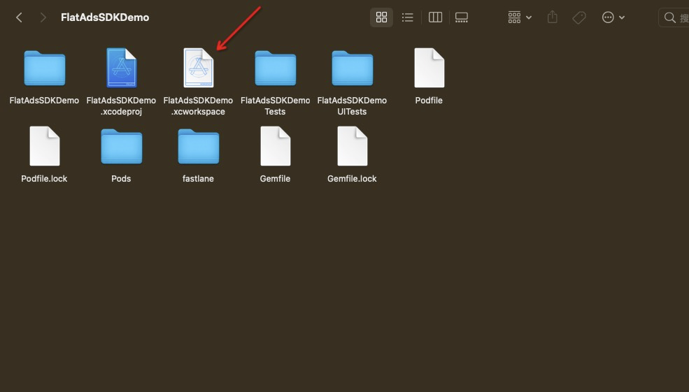
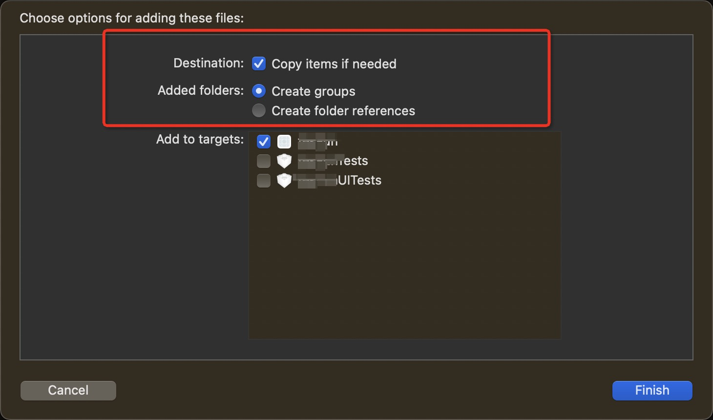
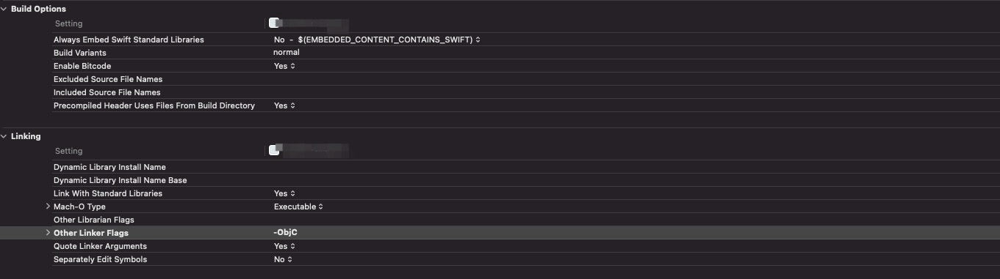
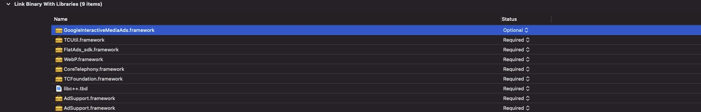
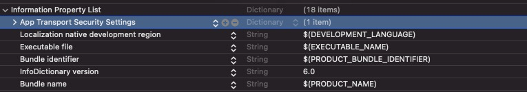

# Flat Ads SDK入门指南
欢迎您选择Flat Ads对接合作，这篇文档将指引您如何操作开发者后台并对接我们的SDK开始您的广告变现，如果您有任何问题请联系您的客户经理。
### 创建账号
请联系您的客户经理为您创建Flat Ads 开发者账号。
### 创建APP和广告位
1. 进入开发者后台后，您需要先为您的账号创建APP/Site及其Placement.

2. 进入新建弹窗，输入您APP的相关信息, 填写的字段释义如下


> Type: 流量类型是APP流量还是Web Site流量；
> 
> Platform：APP的系统平台，是Android还是IOS，如果是Windows之类的请选择其他；
> 
> Bundle：APP的包名；（如果您的Android APP已上架，填写包名后点击Look up，将自动填充Store URL和APP Category）
> 
> Store URL：APP上架商店的详情页链接；
> 
> Domain：Site的域名；
> 
> App Categroy：APP的分类；
> 
> Is app published：您的APP是否已上架；

> Status：APP/Site的状态，如果状态为关，其Appid和token将不再生效；
> 
> COPPA：如果您的APP/Site遵守COPPA，请勾选上；
> 
> TOKEN和Appid：为对接SDK时的验证密钥，新建APP后，自动生成。
> 

3. 完成APP/Site的填写后，保存继续为其创建广告位，填写的字段释义如下


> App/Site：当前创建广告位的归属，一个App/Site可以拥有多个广告位；
> 
> Name：广告位的名称，一般可以命名为"APPNAME_TYPE_SIZE"；
> 
> Bid Floor：广告位的底价，只有高于这个底价的广告才会填充；
> 
> Placement Type：广告位类型，Banner, Native, Interstitial, Rewarded Ad；
> 
> Size：广告位尺寸；
> 
> Allowed Ad Type：支持填充的广告类型；Display(HTML), Static, VAST Video, Playable；
> 
> Refresh Time：Banner广告自动刷新时间；
> 
> Muting：视频广告是否默认静音；
> 
> Allow Skip：允许跳过的时间，单位为秒；
> 
> CTA Popup：是否在视频播放过程中弹出CTA按钮，一般能够提升CTR，但是可能遮罩视频元素；
> 
> Status：广告位状态，状态为关时，广告位将不再请求广告；
> 

### 集成Flat Ads SDK
保存广告位后，就可以进入集成SDK的环节。Flat Ads SDK支持Android，IOS，Unity, Cocos。同时如果您对接了Mopub聚合SDK，我们也只支持Mopub JS Tag作为自定义网盟接入。如果你是Site流量，也可以直接部署我们的JS Tag


### 报表说明
跑出数据后，可以通过报表查看收益数据情况，以下是维度指标的说明


> 维度
> 
> Date：日期
> 
> App/Site：APP或者是Site
> 
> Placement：广告位
> 
> Country：国家
> 
> 指标
> 
> Impression：广告展示
> 
> Clicks：广告点击
> 
> CTR：广告点击率，Clicks/Impression
> 
> eCPM：每千次展示单价，Revenue/Impression*1000
> 
> Revenue：广告收益
> 

# Android SDK
### 添加依赖和初始化
添加依赖

```
dependencies {
   implementation("com.flatads.sdk:flatads:1.4.15")
}

//

allprojects {
    repositories {
        maven {url "http://maven-pub.flat-ads.com/repository/maven-public/"}
        maven { url  "https://jitpack.io" }
    }
}

//混淆规则
-keep class com.flatads.sdk.response.* {*;}
-keep class com.flatads.sdk.core.data.model.** {*;}
```

初始化SDK
```
public class MainActivity extends AppCompatActivity {

    @Override
    protected void onCreate(@Nullable Bundle savedInstanceState) {
        super.onCreate(savedInstanceState);
        setContentView(R.layout.activity_main);
        
        String appId = "xxxxxxxx"; //申请时的appid
        String token = "xxxxxxxxxxxxxxxx"; //申请时的token
        
        FlatAdSDK.initialize(getApplication(), appId, token, new InitListener(){
            @Override
            public void onSuccess() {
            }

            @Override
            public void onFailure(int code, String msg) {
            }
        };
    }
    
}
```

广告必须在初始化完成后调用！

初始化SDK时，需要传入APP的appid和token，这两个值可以在你的账户后台Placement管理页面中找到
 


### 广告位类型
#### Banner 
* 使用Banner广告，需要向布局中添加BannerAdView
```
# main_activity.xml
    ···
    <com.flatads.sdk.ui.BannerAdView
        android:id="@+id/banner"
        android:layout_width="match_parent"
        android:layout_height="match_parent"
        app:banner_size="small_size"/>
    ···
```
app:banner_size：将此属性设置为要使用的广告尺寸。提供了2种类型的banner尺寸：small_size (320x50) 和 big_size (300x250)。不设置默认为big_size (300x250)。
布局中需给广告位设置 match_parent。提供了setBannerSize方法，该方法对布局进行操作，所以必须在主线程中执行。

MainActivity中，需要设置广告的unitid，并且调用loadAd()，展示广告。
```
public class MainActivity extends AppCompatActivity {

    @Override
    protected void onCreate(@Nullable Bundle savedInstanceState) {
        super.onCreate(savedInstanceState);
        setContentView(R.layout.activity_main);

        String appId = "xxxxxxxx"; //申请时的appid
        String token = "xxxxxxxxxxxxxxxx"; //申请时的token

        FlatAdSDK.initialize(getApplication(), appId, token);

        BannerAdView bannerAdView = findViewById(R.id.banner);
        bannerAdView.setAdUnitId("xxxxxxx");
        bannerAdView.loadAd();
    }

    @Override
    protected void onResume() {
        super.onResume();
        if (bannerAdView != null) {
            bannerAdView.resume();
        }
    }

    @Override
    protected void onStop() {
        super.onStop();
        if (bannerAdView != null) {
            bannerAdView.stop();
        }
    }

    @Override
    protected void onDestroy() {
        super.onDestroy();
        if (bannerAdView != null) {
            bannerAdView.destroy();
        }
    }

}
```
* 需要监听广告相关回调事件，在相关的AdView添加Listener。
```
    bannerAdView.setAdListener(new BannerAdListener() {
        @Override
        public void onAdExposure() {
            // 广告曝光
            Toast.makeText(getContext(), "show success", Toast.LENGTH_SHORT).show();
        }

        @Override
        public void onRenderFail(int code, String msg) {
            // 广告渲染失败
            Toast.makeText(getContext(), "onRenderFail：" + code + msg, Toast.LENGTH_SHORT).show();

        }


        @Override
        public void onAdClick() {
            // 点击广告
            Toast.makeText(getContext(), "click", Toast.LENGTH_SHORT).show();
        }

        @Override
        public void onAdClose() {
            // 广告关闭
            Toast.makeText(getContext(), "close", Toast.LENGTH_SHORT).show();
        }

        @Override
        public void onAdLoadSuc() {
            // 广告请求成功
            Toast.makeText(getContext(), "load success", Toast.LENGTH_SHORT).show();
        }

        @Override
        public void onAdLoadFail(int code, String msg) {
            // 广告请求失败
            Toast.makeText(getContext(), "load fail", Toast.LENGTH_SHORT).show();
        }

        @Override
        public void onRefresh() {
            //  自动刷新回调
            Toast.makeText(getContext(), "onRefresh", Toast.LENGTH_SHORT).show();
        }
    });
```

#### Native
native显示样式由用户自定义，但需要调用NativeAdLayout使用做处理，其中媒体用MediaView加载。NativeAdLayout为FrameLayout。
* 向布局中添加NativeAdLayout和MediaView

```
# main_activity.xml
<androidx.constraintlayout.widget.ConstraintLayout xmlns:android="http://schemas.android.com/apk/res/android"
    android:layout_width="match_parent"
    android:layout_height="match_parent"
    xmlns:app="http://schemas.android.com/apk/res-auto">
    <FrameLayout
        android:id="@+id/my_content"
        android:layout_width="match_parent"
        android:layout_height="wrap_content"
        app:layout_constraintTop_toTopOf="parent"/>

</androidx.constraintlayout.widget.ConstraintLayout>
```
```
# native_layout.xml
<?xml version="1.0" encoding="utf-8"?>
<com.flatads.sdk.ui.NativeAdLayout xmlns:android="http://schemas.android.com/apk/res/android"
    xmlns:app="http://schemas.android.com/apk/res-auto"
    xmlns:tools="http://schemas.android.com/tools"
    android:id="@+id/flat_ad_container"
    android:layout_width="match_parent"
    android:layout_height="300dp"
    android:background="@color/white"
    app:layout_constraintBottom_toBottomOf="parent"
    app:layout_constraintTop_toTopOf="parent">

    <androidx.constraintlayout.widget.ConstraintLayout
        android:layout_width="match_parent"
        android:layout_height="match_parent">

        <com.flatads.sdk.ui.MediaView
            android:id="@+id/flat_ad_media_big"
            android:layout_width="match_parent"
            android:layout_height="0dp"
            app:layout_constraintDimensionRatio="w,9:16"
            app:layout_constraintTop_toTopOf="parent" />

        <ImageView
            android:id="@+id/flat_ad_iv_icon"
            android:layout_width="42dp"
            android:layout_height="42dp"
            android:layout_marginStart="8dp"
            android:layout_marginLeft="8dp"
            android:layout_marginTop="12dp"
            android:layout_marginBottom="12dp"
            app:layout_constraintBottom_toBottomOf="parent"
            app:layout_constraintStart_toStartOf="parent"
            app:layout_constraintTop_toBottomOf="@id/flat_ad_media_big" />

        <TextView
            android:id="@+id/flat_ad_button"
            android:layout_width="0dp"
            android:layout_height="wrap_content"
            android:layout_marginTop="21dp"
            android:layout_marginEnd="12dp"
            android:layout_marginRight="12dp"
            android:layout_marginBottom="21dp"
            android:background="@drawable/shape_bg"
            android:paddingStart="10dp"
            android:paddingEnd="10dp"
            android:paddingTop="5dp"
            android:paddingBottom="5dp"
            app:layout_constraintBottom_toBottomOf="parent"
            app:layout_constraintEnd_toEndOf="parent"
            app:layout_constraintTop_toBottomOf="@id/flat_ad_media_big"
            tools:text="sdasdasdsa"/>

        <TextView
            android:id="@+id/flat_ad_tv_title"
            android:layout_width="0dp"
            android:layout_height="wrap_content"
            android:layout_marginStart="8dp"
            android:layout_marginLeft="8dp"
            android:layout_marginEnd="16dp"
            android:layout_marginRight="16dp"
            android:textColor="@color/text_color"
            android:textSize="14sp"
            android:textStyle="bold"
            app:layout_constraintEnd_toStartOf="@id/flat_ad_button"
            app:layout_constraintStart_toEndOf="@id/flat_ad_iv_icon"
            app:layout_constraintTop_toTopOf="@id/flat_ad_iv_icon" />

        <TextView
            android:id="@+id/flat_ad_tv_desc"
            android:layout_width="0dp"
            android:layout_height="wrap_content"
            android:layout_marginStart="8dp"
            android:layout_marginLeft="8dp"
            android:layout_marginTop="5dp"
            android:layout_marginEnd="16dp"
            android:layout_marginRight="16dp"
            android:textColor="@color/text_des_color"
            android:textSize="12sp"
            app:layout_constraintEnd_toStartOf="@id/flat_ad_button"
            app:layout_constraintStart_toEndOf="@id/flat_ad_iv_icon"
            app:layout_constraintTop_toBottomOf="@id/flat_ad_tv_title" />


    </androidx.constraintlayout.widget.ConstraintLayout>

</com.flatads.sdk.ui.NativeAdLayout>

```
MediaView需要设置宽高比例。


```
public class MainActivity extends AppCompatActivity {

    private NativeAd nativeAd;
    @Override
    protected void onCreate(@Nullable Bundle savedInstanceState) {
        super.onCreate(savedInstanceState);
        setContentView(R.layout.activity_main);

        String appId = "xxxxxxxx"; //申请时的appid
        String token = "xxxxxxxxxxxxxxxx"; //申请时的token

        FlatAdSDK.initialize(getApplication(), appId, token);

        nativeAdView = findViewById(R.id.container);
        String adUnitId = "xxxxxxxxx";
        
        nativeAd = new NativeAd(this,adUnitId );

        nativeAd.setAdListener(new NativeAdListener() {
            @Override
            public void onAdLoadSuc(Ad ad) {
                Toast.makeText(getContext(), "load success", Toast.LENGTH_SHORT).show();
                inflateAd(ad);
            }

            @Override
            public void onAdLoadFail(int errorCode, String msg) {
                Toast.makeText(getContext(), "load fail", Toast.LENGTH_SHORT).show();
            }

            @Override
            public void onAdExposure() {
                Toast.makeText(getContext(), "onAdExposure", Toast.LENGTH_SHORT).show();
            }

            @Override
            public void onAdClick() {
                Toast.makeText(getContext(), "click", Toast.LENGTH_SHORT).show();
            }

            @Override
            public void onAdDestroy() {
               Toast.makeText(getContext(), "destroy", Toast.LENGTH_SHORT).show();
            }

            @Override
            public void onRenderFail(int code, String msg) {
                Toast.makeText(getContext(), "onRenderFail", Toast.LENGTH_SHORT).show();

            }
        });
        nativeAd.loadAd();
    }

    private void inflateAd(Ad ad) {
        adView = (NativeAdLayout) getLayoutInflater().inflate(R.layout.native_layout, null);

        TextView tvTitle = adView.findViewById(R.id.flat_ad_tv_title);
        TextView tvDesc = adView.findViewById(R.id.flat_ad_tv_desc);
        TextView tvAdBtn = adView.findViewById(R.id.flat_ad_button);
        View view = adView.findViewById(R.id.flat_ad_container);
        ImageView icon = adView.findViewById(R.id.flat_ad_iv_icon);
        MediaView mediaView = adView.findViewById(R.id.flat_ad_media_big);

        tvTitle.setText(ad.getTitle());
        tvDesc.setText(ad.getDesc());
        tvAdBtn.setText(ad.getAdBtn());

        // Create a list of clickable views
        List<View> clickableViews = new ArrayList<>();
        clickableViews.add(tvAdBtn);
        clickableViews.add(view);

        nativeAd.registerViewForInteraction(adView, mediaView, icon, clickableViews);

    }
    
	@Override
    protected void onPause() {
        super.onPause();
        if (adView!=null){
            adView.pause();
        }
    }

    @Override
    protected void onResume() {
        super.onResume();
        if (adView!=null){
            adView.resume();
        }
    }


    @Override
    protected void onDestroy() {
        super.onDestroy();
        if (adView!=null){
            adView.destroy();
        }
    }
}
```
布局元素获取必须在成功的时候绑定，需要在加载成功后对布局进行操作，最后调用nativeAd.registerViewForInteraction将adView, mediaView, icon, clickableViews传给nativeAd处理

> 注意： 需要在activity destroy时销毁adview

#### Interstitial

```
public class MainActivity extends AppCompatActivity {

    private InterstitialAd interstitialAd;
    @Override
    protected void onCreate(@Nullable Bundle savedInstanceState) {
        super.onCreate(savedInstanceState);
        setContentView(R.layout.activity_main);

        String appId = "xxxxxxxx"; //申请时的appid
        String token = "xxxxxxxxxxxxxxxx"; //申请时的token

        FlatAdSDK.initialize(getApplication(), appId, token);

        String adUnitId = "xxxxxxxxx";
        interstitialAd = new InterstitialAd(this, adUnitId);
        interstitialAd.setAdListener(new InterstitialAdListener() {
            @Override
            public void onAdLoadSuc() {
                interstitialAd.show();
                Toast.makeText(getContext(), "load success", Toast.LENGTH_SHORT).show();
            }

            @Override
            public void onAdClose() {
                Toast.makeText(getContext(), "close", Toast.LENGTH_SHORT).show();
            }

            @Override
            public void onAdLoadFail(int code, String msg) {
                Toast.makeText(getContext(), "load fail, code: " + code + "msg:" + msg, Toast.LENGTH_SHORT).show();
            }

            @Override
            public void onAdExposure() {
                Toast.makeText(getContext(), "show success", Toast.LENGTH_SHORT).show();
            }

            @Override
            public void onRenderFail(int code, String msg) {
                Toast.makeText(getContext(), "onRenderFail", Toast.LENGTH_SHORT).show();

            }

            @Override
            public void onAdClick() {
                Toast.makeText(getContext(), "click", Toast.LENGTH_SHORT).show();
            }
        });
        interstitialAd.loadAd();
    }

}
```
需要在请求广告完成时再调用show方法展示广告。

#### 激励视频
```
public class RewardedActivity extends AppCompatActivity {

    RewardedAd rewardedAd;

    @Override
    protected void onCreate(@Nullable Bundle savedInstanceState) {
        super.onCreate(savedInstanceState);
        setContentView(R.layout.rewarded_test);
        Map<String, String> map = new HashMap<>();
        map.put("customer_id", "1234567");
        map.put("unique_id", "uihj89uijkbn7uy8");
        map.put("reward_type", "add_coins");
        map.put("reward_value", "2");
        map.put("verifier", "tyuidjkol");
        map.put("extinfo", "{'self define':'xxx'}");
        String adUnitId = "xxxxxxxxxxxxxxxx"
        rewardedAd = new RewardedAd(this,adUnitId);
        rewardedAd.setRequestParams(map);
        rewardedAd.setAdListener(new RewardedAdListener() {
            @Override
            public void onAdClose() {
                Toast.makeText(getContext(), "close", Toast.LENGTH_SHORT).show();
            }

            @Override
            public void onUserEarnedReward() {
                Toast.makeText(getContext(), "获取奖励", Toast.LENGTH_SHORT).show();
            }

            @Override
            public void onAdFailedToShow() {
                Toast.makeText(getContext(), "播放失败", Toast.LENGTH_SHORT).show();
            }

            @Override
            public void onAdExposure() {
                Toast.makeText(getContext(), "open", Toast.LENGTH_SHORT).show();
            }

            @Override
            public void onAdClick() {
                Toast.makeText(getContext(), "click", Toast.LENGTH_SHORT).show();
            }

            @Override
            public void onAdLoadSuc() {
                Toast.makeText(getContext(), "load success", Toast.LENGTH_SHORT).show();
            }

            @Override
            public void onAdLoadFail(int code, String msg) {
                Toast.makeText(getContext(), "load fail", Toast.LENGTH_SHORT).show();
            }
        });
        rewardedAd.load();

    }

}
```

> 注意：当请求成功后，isReady()为true，可根据此值判断广告是否准备好。
加载激励广告前。需要传入激励广告的相关信息（以上是测试数据）

|  字段名称   | 类型  |  取值（举例）  |  说明  |字段名称|
|  ----  | ----  | ----  | ----  | ----  |
| customer_id  | string |1234567|受激励的客户id|可选|
| unique_id  | string |uihj89uijkbn7uy8|激励的唯一id|可选|
|  reward_type   | 激励类型|add_coins|激励的类型，开发者自定义|可选|
|  reward_value  | 激励值  |2|激励的值，开发者自定义|可选|
| verifier  | 验证码 |tyuidjkol|接入方生产的验证码，用于回调链的验证|可选|
| extinfo  | 额外信息 |{"self define":"xxx"}|接入方自定义||


#### 互动广告
互动广告的大小由开发者自己决定，使用时可先触发loadAd，后续再把布局添加到界面上，可以更快的显示广告内容。
```
    ...
    <com.flatads.sdk.ui.view.InteractiveView
        android:id="@+id/interactive_view"
        android:layout_width="50dp"
        android:layout_height="50dp"
        />
    ...
```
```
public class MainActivity extends AppCompatActivity {

    private InteractiveView interactiveView;
    @Override
    protected void onCreate(@Nullable Bundle savedInstanceState) {
        super.onCreate(savedInstanceState);
        setContentView(R.layout.activity_main);

        String appId = "xxxxxxxx"; //申请时的appid
        String token = "xxxxxxxxxxxxxxxx"; //申请时的token

        FlatAdSDK.initialize(getApplication(), appId, token);

        String adUnitId = "xxxxxxxxx";
        interactiveView = findViewById(R.id.interactive_view);
        interactiveView.setAdUnitId(adUnitId);
        interactiveView.setCacheTime(1000 * 10);
        interactiveView.setAdListener(new InteractiveAdListener() {
            @Override
            public void onRenderSuccess() {
                Toast.makeText(getContext(), "onRenderSuccess", Toast.LENGTH_SHORT).show();
            }

            @Override
            public void onRenderFail(int code, String msg) {
                Toast.makeText(getContext(), "onRenderFail" + code + msg, Toast.LENGTH_SHORT).show();
            }

            @Override
            public void onAdClick() {
                Toast.makeText(getContext(), "onAdClick", Toast.LENGTH_SHORT).show();
            }

            @Override
            public void onAdClose() {
                Toast.makeText(getContext(), "onAdClose", Toast.LENGTH_SHORT).show();
            }

            @Override
            public void onAdLoadSuc() {
                Toast.makeText(getContext(), "onAdLoadSuc", Toast.LENGTH_SHORT).show();
            }

            @Override
            public void onAdLoadFail(int code, String msg) {
                Toast.makeText(getContext(), "onAdLoadFail" + code + msg, Toast.LENGTH_SHORT).show();
            }
        });
        interactiveView.loadAd();
    }

}
```

setCacheTime为设置缓存时间，默认为24小时。

如果开发者想指定互动广告icon图片，提供了方法设置：
```
interactiveView.setIconView(Drawable)
interactiveView.setIconView(Bitmap)
interactiveView.setIconView(url)
```

注意：Activity销毁时需要调用onDestroy方法
```
interactiveView.onDestroy()
```

> 注意：
1.互动广告需要尽早的调用，如可在进入app时进行互动广告加载，在需要展示互动广告时，把view添加到布局上面去。
2.广告回调onAdExposure时，则webview已经加载完成。

### 闪屏广告
在APP的启动页面Activity的onCreate方法中调用以下代码：

```

String unitid = "a839bc20-6592-11ed-b410-4365750446c9";  // 申请到的unitid
// 创建 OpenScreenAd 实例，传入当前页面的context，广告unitid
OpenScreenAd openScreenAd = new OpenScreenAd(SplashActivity.this, unitid);

// 监听
openScreenAd.setAdListener(new OpenScreenAdListener() {
@Override
public void onAdExposure() {

        }

@Override
public void onRenderFail(int code, String msg) {

        }

@Override
public void onAdClick() {

        }

@Override
public void onAdClose() {
        startActivity(new Intent(SplashActivity.this,DemoActivity.class));
        finish();
        }

@Override
public void onAdLoadSuc() {
        openScreenAd.show();
        }

@Override
public void onAdLoadFail(int code, String msg) {

        }
});


//  展示闪屏广告
openScreenAd.show();

```

> 注意：
> 仅需要在onAdClose回调中处理进入首页的逻辑，当广告回调失败时，不需要再次在onAdLoadFail处理进入首页的代码。
> 需要在设置监听的之后调用show()方法展示广告。
### 竞价
SDK支持竞价功能
```
//banner
bannerAdView.bidding((isGetAd, price) -> {});

//native
NativeAd nativeAd = new NativeAd(adUnitId, this);
nativeAd.bidding((isGetAd, price) -> {});

//interstitial
interstitialAd = new InterstitialAd(this);
interstitialAd.bidding((isGetAd, price) -> {});

//rewarded
RewardedAd rewardedAd = new RewardedAd(this);
rewardedAd.setRequestParams(map);  //map为激励广告参数
rewardedAd.bidding((isGetAd, price) -> {});
```

isGetAd 如果返回false，则说明无广告获取
竞价后会返回广告价格price，开发者可根据价格决定是否需要广告，如需要广告需要调用winBidding。

```
//banner
bannerAdView.winBidding();

//native
nativeAd.winBidding();

//interstitial
interstitialAd.winBidding();

//rewarded
rewardedAd.winBidding();
```
如果广告需要该广告，后续调用
```
//banner:需要将bannerview 添加到布局上

//native:将view渲染完add到布局上，和正常的展示一样

interstitialAd.show();//interstitial广告

rewardedAd.show(); //rewarded广告

```


### 更多说明

####  注意事项

1. 接入时需对app开启存储权限后才可以正常下载广告配置的apk，否则部分手机将无下载反应。
2. 混淆时，需添加 -keep class com.flatads.sdk.response.* {*;} ，否则将无数据返回。

```
<?xml version="1.0" encoding="utf-8"?>
<network-security-config xmlns:tools="http://schemas.android.com/tools"
    tools:ignore="MissingDefaultResource">
    <base-config cleartextTrafficPermitted="true">
        <trust-anchors>
            <certificates src="system" overridePins="true" />
            <certificates src="user" overridePins="true" />
        </trust-anchors>
    </base-config>
</network-security-config>
```
接着，在AndroidManifest.xml文件下的application标签增加以下属性
```

<application
...
 android:networkSecurityConfig="@xml/network_security_config"
...
    />
```


# Unity for Android

## SDK项目部署

将 untiy/android/plugin 中的C#脚本导入到Unity工程中，并在游戏启动时调用SDK初始化
```C#
    ...
    void start(){
        FlatInit flatInit = new FlatInit();
        FlatInitListener initListener = new FlatInitListener();
        flatInit.initSDK("appId","appToken",initListener);
    }
```
其中 initSDK 第一个参数是appId，第二个参数是appToken，第三个参数是初始化成功失败的回调。

## 互动广告使用
```C#
    private InteractiveAd interactiveAd;

    private AndroidJavaClass act;
    private AndroidJavaObject actObj;
    ...

    public void createInteractiveAd(){
        if(interactiveAd == null){
            interactiveAd = new InteractiveAd();
            interactiveAd.createInteractiveAd(actObj,"unitId",200,200,0,0,0,0,600,400);
        }
    }

    public void loadInteractiveAd(){
        if(interactiveAd != null){
            InteractiveListener listener = new InteractiveListener();
            interactiveAd.loadInteractiveAd(actObj,listener);
        }
    }
```
其中 InteractiveAd#createInteractiveAd 分别传入的参数是

1.游戏的Activity

2.广告的unitId

3~4.互动广告的宽高

5~8.左、右、上、下的偏移

9~10.在游戏页面的位置，传入以下值对应位置

100 -- left -- 页面左边

200 -- right -- 页面右边

300 -- top -- 页面顶部

400 -- bottom -- 页面底部

500 -- center -- 页面居中

600 -- center_horizontal -- 页面水平居中

700 -- center_vertical -- 页面垂直居中

在创建完互动广告实例后，调用InteractiveAd#loadInteractiveAd开始加载互动广告，需要传入游戏页面的Activity和广告的listener。

在游戏退出时，需要调用InteractiveAd#destroy销毁互动广告对象。

C#代码处理完后，需要将Unity工程转为Android工程
步骤：File -> Build Settings -> Platform选择Android -> 勾选Export Project -> Export 成功导出android工程
-> 在android工程中，build.gradle中添加
```

...
allprojects {
    ...
    maven { url "http://maven.flat-ads.com/repository/maven-public/" }
}
...

dependencies {
    implementation 'com.flat.androidplugin:androidplugin:1.0.0'
}
```

-> 在src/main/res文件下创建名为xml的文件夹，并新建xml文件network_security_config
```
<?xml version="1.0" encoding="utf-8"?>
<network-security-config xmlns:tools="http://schemas.android.com/tools"
    xmlns:android="http://schemas.android.com/apk/res/android"
    tools:ignore="MissingDefaultResource">
    <base-config cleartextTrafficPermitted="true">
        <trust-anchors>
            <certificates src="system" overridePins="true" />
            <certificates src="user" overridePins="true" />
        </trust-anchors>
    </base-config>
</network-security-config>
```

-> 创建完xml文件后，找到AndroidManifest，在application标签中添加 android:networkSecurityConfig="@xml/network_security_config"

以上处理完后点击run即可开始打包运行游戏

# iOS SDK

## SDK项目部署
### 自动部署
自动部署可以省去您工程配置的时间。iOS SDK会通过CocoaPods进行发布，推荐您使用自动部署。

#### 安装CocoaPods
CocoaPods是一个Swift和Objective-C项目的依赖管理器。CocoaPods可以帮助你优雅的扩展你的项目。 如果您未安装过 cocoaPods，可以通过以下命令行进行安装。更多详情请访问 [CocoaPods官网](https://cocoapods.org/ "CocoaPods官网")。
```bash
$ sudo gem install cocoapods
```

注意：安装过程可能会耗时比较长，也有可能收到网络状况导致失败，请多次尝试直到安装成功。

#### 配置Podfile文件
在您的工程文件所在文件夹下有一个名为Podfile的文件。如果您第一次使用CocoaPods，可以在通过以下命令初始化一个Podfile文件：

```bash
$ pod init
```

打开 Podfile 文件，应该是如下内容（具体内容可能会有一些出入）：
```ruby
platform :ios, '10.0'

target 'Your Project Target' 
  #use_frameworks!
  #Pods for podTest
end
```
修改Podfile文件，将 pod 'FlatAds_sdk' 添加到 Podfile 中，如下所示：
```ruby
platform :ios, '10.0'

target 'Your Project Target' do
  #use_frameworks!
  pod "FlatAds_sdk", "~> 1。1.0"
end
```
#### 使用CocoaPods进行SDK部署
通过CocoaPods安装SDK前，确保CocoaPods索引已经更新。可以通过运行以下命令来更新索引：
```bash
$ pod repo update
```
运行命令进行安装：
```bash
$ pod install 
```
也可以将上述两条命令合成为如下命令:
```bash
$ pod install --repo-update
```
命令执行成功后，会生成.xcworkspace文件，可以打开.xcworkspace来启动工程，如下图所示。


#### 升级SDK
升级SDK时，首先要更新repo库，执行命令：
```bash
$ pod repo update
```
之后重新执行如下命令进行安装即可升级至最新版SDK
```bash
$ pod install
```
**注意** ：请确保每次引入的都是SDK最新版本，以获得功能扩展、性能提升、稳定性提升等特性

### 手动部署
本小节会指导您手动将iOS SDK进行集成。在此之前，请先下载下面我们提供的 SDK ：

| Version |                          Resources                           |
| :-----: | :----------------------------------------------------------: |
|  1.0.7  | [FlatAds_sdk_1.0.7](/resourecs/FlatAds_sdk_1.0.7.zip "FlatAds_sdk_1.0.7") |
|  1.1.0  | [FlatAds_sdk_1.1.0](/resourecs/FlatAds_sdk_1.1.0.zip "FlatAds_sdk_1.1.0") |

如果您没有项目，请先创建一个空白项目。再添加依赖库

将解压缩后的 FlatAds_sdk 文件拖到工程文件夹中，然后在按下图所示选中这两项:



需要引入的系统依赖库

| 库名称  |  SDK |
| ------------ | ------------ |
| AdSupport.framework  |  4.72及以后版本 |
| CoreTelephony  |  同上|
| libc++.tbd  |  同上 |
| Security  |  同上 |
| CoreMedia  |  同上 |
| WebKit |  同上 |
| SystemConfiguration  |  同上 |
| CoreTelephony  |  同上 |
| MobileCoreServices  |  同上 |
| AppTrackingTransparency  |  同上 |
| AVFoundation |  同上 |

其他设置
在 Target->Build Settings -> Other Linker Flags 中添加 -ObjC (字母 o 和 c 大写)和 $(inherited) 。



在 Target->Build Phasses ->Link Binary With Libraries 中把 GoogleInteractiveMediaAds.framework 的 Status 改为 Optional 。



苹果公司在iOS9中升级了应用网络通信安全策略，默认推荐开发者使用HTTPS协议来进行网络通信，并限制HTTP协议的请求。为了避免出现无法拉取到广告的情况，我们推荐开发者在info.plist文件中增加如下配置来实现广告的网络访问：（信任HTTP请求）




### IOS 14适配
* SKAdNetwork（SKAN）是 Apple 的归因解决方案，可帮助广告客户在保持用户隐私的同时衡量广告活动。 使用 Apple 的 SKAdNetwork 后，即使 IDFA 不可用，广告网络也可以正确获得应用安装的归因结果。 访问https://developer.apple.com/documentation/storekit/skadnetwork了解更多信息。**为了广告转化的归因，所有开发者须设置SKAdNetwork方案的 FlatAdSDK SKAdNetwork id。**
* App Tracking Transparency (ATT)适用于请求用户授权，访问与应用相关的数据以跟踪用户或设备。 访问https://developer.apple.com/documentation/apptrackingtransparency了解更多信息。**目前苹果要求在iOS 14.5及以上的版本中必须在弹窗取得用户同意后，才可以追踪用户。对其他版本暂无明确要求，开发者应根据需要配置弹窗。**

**Checklist**

1. 应用编译环境升级至Xcode 12.0 及以上版本

2. 将 FlatAdSDK 的 SKAdNetwork ID 添加到 info.plist 中，以保证SKAdNetwork的正确运行

```
<key>SKAdNetworkItems</key>
  <array>
    <dict>
      <key>SKAdNetworkIdentifier</key>
      // FlatAdSDK SKAdNetwork id
      <string>xxxxxx.skadnetwork</string>
    </dict>
    <dict>
      <key>SKAdNetworkIdentifier</key>
      // FlatAdSDK SKAdNetwork id
      <string>xxxxxx.skadnetwork</string>
    </dict>
    <dict>
      <key>SKAdNetworkIdentifier</key>
      // FlatAdSDK SKAdNetwork id
      <string>xxxxxx.skadnetwork</string>
    </dict>
  </array>
```

3.支持苹果 ATT：从 iOS 14 开始，若开发者设置 App Tracking Transparency 向用户申请跟踪授权，在用户授权之前IDFA 将不可用。 如果用户拒绝此请求，应用获取到的 IDFA 将自动清零，可能会导致您的广告收入的降低

* 要获取 App Tracking Transparency 权限，请更新您的 Info.plist，添加 NSUserTrackingUsageDescription 字段和自定义文案描述。代码示例：

```
<key>NSUserTrackingUsageDescription</key>
<string>该标识符将用于向您投放个性化广告</string>
```
* 向用户申请权限时，请调用以下方法。我们建议您申请权限后再请求广告，以便 FlatAdSDK 准确的获得用户授权状态。

```
#import <FlatAds_sdk/FlatAds_sdk.h>

if (@available(iOS 14, *)) {
    [FlatAdsSDK requestIDFAWithCompletionHandler:^(ATTrackingManagerAuthorizationStatus status) {
        // Tracking authorization completed. Start loading ads here.
        [self loadAds];
     }];
 }
```

### 初始化
初始化SDK
```objc
#import <FlatAds_sdk/FlatAds_sdk.h>

[FlatAdsSDK setAppID:@"your appid" appToken:@"your app token"];
```

初始化SDK时，需要传入APP的appid和token，这两个值可以在你的账户后台Placement管理页面中找到
 

**日志输出说明**
```objc
 #if DEBUG
    [FlatAdsSDK setLogLevel:FALogLevelDebug];
#endif
```

### 广告位类型
#### Banner
**创建广告位对象、请求广告 FAAdBannerView**
请求广告时需要传入广告位对象，广告位对象创建时必须传入广告位ID

```objc
FAAdBannerUnitModel* unitModel = [FAAdBannerUnitModel new];
unitModel.unitId = @"your unit id";
// 目前只提供了两种样式 
// FAAdBannerSizeType320x50
// FAAdBannerSizeType300x250
unitModel.sizeType = FAAdBannerSizeType320x50;


FAAdBannerView *bannerView = [[FAAdBannerView alloc] initWithUnitModel:unitModel];
[self.bannerView addSubview:view];
bannerView.frame = CGRectMake(0, 0, self.view.frame.size.width, 50);
[bannerView loadAds];
```
使用 FAAdBannerView 创建对象，使用 FAAdBannerView 调用 loadAds 请求广告

**FABannerAdViewDelegate  回调方法**
```objc
/// This method is called when adView ad slot loaded successfully.
- (void)bannerAdViewLoadSuccess:(nonnull FAAdBannerView *)bannerAdView;

/// This method is called when adView ad slot failed to load.
- (void)bannerAdView:(nonnull FAAdBannerView *)bannerAdView didLoadFailWithError:(nonnull NSError *)error;

/// Tells the delegate that an impression has been recorded for an ad.
- (void)bannerAdViewDidRecordImpression:(nonnull FAAdBannerView *)bannerView;

/// This method is called when ad is clicked.
- (void)bannerAdViewDidClick:(nonnull FAAdBannerView *)bannerAdView;

/// This method is called when ad is Closed.
- (void)bannerAdViewDidClosed:(nonnull FAAdBannerView *)bannerAdView;
```

#### Native
FAAdNativeView 类提供了原生广告的数据绑定、点击事件的上报，需要开发者自行定义广告展示形态与布局。

创建广告位对象、请求广告 FAAdNativeView
请求广告时需要传入广告位对象，广告位对象创建时必须传入广告位ID
```objc
FAAdUnitModel* unitModel = [FAAdUnitModel new];
unitModel.unitId = @"your unit id";

[FAAdNativeView loadWithAdUnitModel:unitModel 
                  completionHandler:^(FAAdNativeView * _Nullable nativeView, NSError * _Nullable error) {
    if (!nativeView) {
        return;
    }
    FAAdNativeView *nativeAdView =[FAAdNativeView new];
    nativeAdView.frame = CGRectMake(0, 0, 320, 280);
    nativeAdView.delegate = self;
    [self.view addSubview:nativeAdView];

    // 为 nativeView 里的 UI 设置 Frame 或 Auto Layout
    FAMediaView* mediaView = [FAMediaView new];
    [nativeAdView addSubview:mediaView];
       nativeAdView.mediaView = mediaView;

    UIImageView *iconView = [[UIImageView alloc] init];
    [iconView setImageWithString:self.nativeAd.images.firstObject.url];
    [nativeAdView addSubview:iconView];
    nativeAdView.iconView = iconView;

    UILabel *callToActionView = [[UILabel alloc] init];
    callToActionView.text = self.nativeAd.callToAction;
    callToActionView.textColor = UIColor.whiteColor;
    callToActionView.backgroundColor = UIColor.greenColor;
    callToActionView.textAlignment = NSTextAlignmentCenter;
    [nativeAdView addSubview:callToActionView];
    nativeAdView.callToActionView = callToActionView;

    UILabel *headlineView = [[UILabel alloc] init];
    headlineView.text = self.nativeAd.headline;
    headlineView.font = [UIFont systemFontOfSize:14.f];
    [nativeAdView addSubview:headlineView];
    nativeAdView.headlineView = headlineView;

    UILabel *bodyView = [[UILabel alloc] init];
    bodyView.text = self.nativeAd.body;
    bodyView.numberOfLines = 2;
    bodyView.font = [UIFont systemFontOfSize:12.f];
    [nativeAdView addSubview:bodyView];
    nativeAdView.bodyView = bodyView;

    UIView* infoIconView = [UIView new];
    [nativeAdView addSubview:infoIconView];
    nativeAdView.infoIconView = infoIconView;
    nativeAdView.expanPosition = FAInfoIconButtonExpanPositionLeft;

    nativeAdView.nativeAd = self.nativeAd;

    if (nativeAdView.nativeAd.mediaContent.hasVideoContent) {
        [nativeAdView playVideo];
    }
}];
```

**广告 UI 素材**

```objc
/// the native ad object
@property(nonatomic, strong, nullable) FANativeAd *nativeAd;

///Reference to the object that implements FANativeAdViewDelegate protocol; will receive load events for the given unitId.
@property (nonatomic, weak, nullable) id<FANativeAdViewDelegate> delegate;

/// media view
@property (nonatomic, strong) FAMediaView *mediaView;

/// logo image
@property (nonatomic, strong) UIView *iconView;

/// ad title
@property (nonatomic, strong) UIView *headlineView;

/// ad desc
@property (nonatomic, strong) UIView *bodyView;

/// info button
@property (nonatomic, strong) UIView *infoIconView;

/// call to action button
@property (nonatomic, strong) UIView *callToActionView;

/// the info Icon expan position
@property (nonatomic, assign) FAInfoIconButtonExpanPosition expanPosition;

/// Whether the InfoView needs to be expanded. Default is YES
@property (nonatomic, assign) BOOL isExpandInfoView;

/// Play the video, if nativeAd.hasVideoContent = YES
- (void)playVideo;
```

设置 infoIconButton 位置，往反方向展开

```objective-c
nativeView.infoIconButton.position = FAInfoIconButtonPositionRight;
```

设置是否需要展开 info 角标

```objective-c
nativeView.isExpandInfoView = YES;
```

**FANativeAdViewDelegate  回调方法**

```objc
/// This method is called when adView ad slot failed to load.
- (void)nativeAdView:(nonnull FAAdNativeView *)nativeView didLoadFailWithError:(nonnull NSError *)error;

/// Tells the delegate that an impression has been recorded for an ad.
- (void)nativeAdViewDidRecordImpression:(nonnull FAAdNativeView *)nativeView;

/// This method is called when ad is clicked.
- (void)nativeAdViewDidClick:(nonnull FAAdNativeView *)nativeView;

/// This method is called when ad is Closed.
- (void)nativeAdViewDidClosed:(nonnull FAAdNativeView *)nativeView;
```

#### Interstitial
**创建广告位对象、请求广告 FAInterstitialAd**
请求广告时需要传入广告位对象，广告位对象创建时必须传入广告位ID

```objc
FAAdUnitModel* unitModel = [FAAdUnitModel new];
unitModel.unitId = @"your unit id";

[FAInterstitialAd loadWithAdUnitModel:unitModel
                    completionHandler:^(FAInterstitialAd * _Nullable interstitialAd, NSError * _Nullable error) {
    if (error) {
    } else {
        self.interstitialView = interstitialAd;
        self.interstitialView.delegate = self;

        [self.interstitialView presentAdFromRootViewController:self];
    }
}];
```
**展示广告**
调用 presentAdFromRootViewController: 方法展示插屏广告，此处需要传入当前展示的页面。一定要设置rootViewController，即展示广告和跳转落地页需要的 viewController。

**FAAdInterstitialDelegate  回调方法**

```objc
/// This method is called when adView ad slot failed to load.
- (void)interstitialAd:(FAInterstitialAd *)interstitialAd didFailWithError:(NSError * __nullable)error;

/// Tells the delegate that an impression has been recorded for an ad.
- (void)interstitialAdDidRecordImpression:(nonnull FAInterstitialAd *)interstitialAd;

/// This method is called when ad is clicked.
- (void)interstitialAdDidClicked:(nonnull FAInterstitialAd *)interstitialAd;

/// This method is called when ad is Closed.
- (void)interstitialAdDidClosed:(nonnull FAInterstitialAd *)interstitialAd;
```

#### FARewardedAd
**创建广告位对象、请求广告 FARewardedAd**
请求广告时需要传入广告位对象，广告位对象创建时必须传入广告位ID

```objc
FAAdRewardUnitModel* unitModel = [FAAdRewardUnitModel new];
unitModel.unitId = @"your unit id";
// 可选参数
unitModel.customerId = @"34579827459205"; // 受激励的客户id
unitModel.uniqueId = @"789764790456"; // 激励的唯一id
unitModel.type = @"金币"; // 激励的类型，开发者自定义
unitModel.amount = @30; //     激励的值，开发者自定义
unitModel.verifier = @"https://www.xxxxxx.com"; // 接入方生产的验证码，用于回调链的验证
unitModel.extinfo = @"test extinfo"; // 接入方自定义

[FARewardedAd loadWithAdUnitModel:unitModel
                    completionHandler:^(FARewardedAd * _Nullable rewardedAd, NSError * _Nullable error) {
    if (error) {

    } else {
        self.rewarded = rewardedAd;
        self.rewarded.delegate = self;

        [self.rewarded presentAdFromRootViewController:self];
    }
}];
```

**展示广告**
调用 presentAdFromRootViewController: 方法展示插屏广告，此处需要传入当前展示的页面。一定要设置rootViewController，即展示广告和跳转落地页需要的 viewController。

**FAAdInterstitialDelegate  回调方法**

```objc
/// This method is called when adView ad slot failed to load.
- (void)rewardedAd:(FARewardedAd *)rewardedAd didFailWithError:(NSError * _Nullable)error;

/// Tells the delegate that an impression has been recorded for an ad.
- (void)rewardedAdDidRecordImpression:(nonnull FARewardedAd *)rewardedAd;

/// This method is called when ad is clicked.
- (void)rewardedAdDidClicked:(nonnull FARewardedAd *)rewardedAd;

/// This method is called when ad is Closed.
- (void)rewardedAdDidClosed:(nonnull FARewardedAd *)rewardedAd;

/// This method is called when the user earns a reward.
/// @param rewardedAd self
/// @param rewarded rewarded info
- (void)rewardedAd:(nonnull FARewardedAd *)rewardedAd didRewardEffective:(FAAdRewardUnitModel *)rewarded;

```

### In-App-Biddding 应用头部竞价

FlatAd SDK 支持在移动应用中竞价。我们提供了四种不同的广告格式，包括 Banner，原生，插屏，激励视频。以下为竞价步骤：

- 创建 **FABiddingRequest** 对象并竞价请求 

在 SDK 初始化完成之后，在您的 iOS 项目中，创建如下代码：

```objc
    FABiddingRequestParameter *param = [[FABiddingRequestParameter alloc] initWithUnitId:@"your unit id"];
    
    [FABiddingRequest getBidWithRequestParameter:param
                               completionHandler:^(FABiddingResponse * _Nonnull bidResponse) {
        if (bidResponse.success) {
            // bid  successful
        } else {
        	// bid failed
        }
    }];
```

- 处理竞价结果

在这部分中，我们采用 FlatAd SDK 的出价响应与其他买家的 CPM 价格进行比较，并决定 FlatAd SDK 是赢得并加载广告，还是失败。 当您确定拍卖结果时，请调用方法 **notifyWin** 或 **notifyLoss** 以通知 FlatAd SDK 结果。
	请注意，拍卖逻辑由应用程序本身实现。 它应该简单地比较投标价格并选择最高出价者作为拍卖获胜者。
以下是如何使用返回的 **FABiddingResponse** 并运行竞价的示例。

```objc
    FABiddingRequestParameter *param = [[FABiddingRequestParameter alloc] initWithUnitId:@"your unit id"];
    
    [SVProgressHUD show];
    
    [FABiddingRequest getBidWithRequestParameter:param
                               completionHandler:^(FABiddingResponse * _Nonnull bidResponse) {
        self.bidResponse = bidResponse;
        if (bidResponse.success) {
			self.bidToken = bidResponse.bidToken;
            NSLog(@"%@", "bid success"];
            [bidResponse notifyWin];
        } else {
			NSLog(@"%@", "bid failed"];
        }
    }];
```

- 根据竞价结果，加载对应的广告

当 FlatAd SDK 出价赢得竞价后，下一步是使用 **bidToken** 方法来请求广告。

此部分与普通请求广告步骤一样，只有一处不同，您需要在初始化广告的时候把 bidToken 带上，此时则不需要传入 unit id。其中对于bidToken，您可以通过这样来获取：bidResponse.bidToken。

Delegate的回调方法与普通请求广告是一样的。

在这里，我们以 Banner 广告为例：

```objc
    FAAdBannerUnitModel* unitModel = [FAAdBannerUnitModel new];
    unitModel.sizeType = FAAdBannerSizeType320x50;
    unitModel.token = self.bidToken; 

    self.bannerView = [[FAAdBannerView alloc] initWithUnitModel:unitModel];
    self.bannerView.delegate = self;
    [self.bannerView loadAds];
    self.bannerView.frame = CGRectMake(0,
                                       self.view.frame.size.height - 50,
                                       self.view.frame.size.width,
                                       50);
		[self.view addSubview:self.bannerView];
```

### 更多说明

####  注意事项
1. 必须要设置 rootViewController，用来处理广告跳转。SDK里所有的跳转均采用 present 的方式，请确保传入的 rootViewController 不能为空且没有 present 其他的控制器，否则会出现 presentedViewController 已经存在而导致 present 失败。
2. 判断广告素材是否准备好直接使用 isAdReady 判断即可


------------


# COCOS Creator集成 Flat Ads SDK

### Android导入说明
1. 需要将FlatAd SDK的xxxx.aar文件放到Android工程的libs目录下和添加相关Maven依赖。并在build.gradle进行引用
```
dependencies {
    api fileTree(include: ['*.jar','*.aar'], dir: 'libs')
    implementation 'com.flatads.sdk:flatads:1.0.4'
}
```
并在跟目录gradle增加依赖仓库
```
maven {url "http://maven.flat-ads.com/repository/maven-public/"}
```

2. 混淆规则：
```
-keep public class com.flat.ad.forcocos.** { *; }
-keep class com.flatads.sdk.response.* {*;}
```
3. 开启Java编译。在gradle开启Java 8编译
```
compileOptions {
        sourceCompatibility JavaVersion.VERSION_1_8
        targetCompatibility JavaVersion.VERSION_1_8
    }
```

### 初始化
1. 导入SDK脚本代码到asset目录下。 
2 .使用申请到的AppId和AppToken初始化SDK
```
FlatAdSdk.initSdk(appId, appToken);
```


### 广告位类型
#### Banner 
使用以下代码代码加载Banner广告。
```
FlatBannerAdJs.initBanner(unitId, style); //初始化Banner广告，传入广告ID和Banner广告样式
FlatBannerAdJs.loadBanner(unitId); //load广告，广告load完之后会自动展示。
```
banner广告支持的样式字段
```
public static final int DISPLAY_SIZE = 1;
public static final int STATIC_SIZE = 2;
public static final int STATIC_NORMAL_SIZE = 3;
public static final int DISPLAY_BIG_SIZE = 4;
public static final int STATIC_BIG_SIZE = 5;
```
增加Banner广告的监听接口
```
FlatBannerAdJs.setAdListener : function (listener)
```
其中Listener要实现的接口
```
onBannerAdLoaded : function (unitId, info);
onBannerAdLoadFail : function(unitId);
onBannerAdShow : function(unitId, info);
onBannerAdClick : function(unitId, info);
onBannerAdClose : function(unitId, info);
```

#### Interstitial
使用以下代码加载广告
```
FlatInterstitialAdJs.initInterstitial(unitId);
FlatInterstitialAdJs.setAdListener(listener);
FlatInterstitialAdJs.loadAd(unitId);
```
其中Listener需要实现的接口
```
onInterstitialAdLoaded : function (unitId, info);
onInterstitialAdLoadFail : function(unitId);
onInterstitialAdShow : function(unitId, info);
onInterstitialAdClick : function(unitId, info);
onInterstitialAdClose : function(unitId, info);
```
最后在onInterstitialAdLoaded回调方法中调用showAd的方法
```
FlatInterstitialAdJs.showAd(unitId);
```
#### Native
使用以下代码加载Native广告
```
FlatNativeAd.initNative(unitId,viewConfig); //初始化NativeView
FlatNativeAd.setAdListener(listetener); //设置回调监听
FlatNativeAd.loadNative(unitId); //loadNative
```
其中viewConfig参数为指定Native广告UI样式Json字符串，其形式如下：
```
{"root":{
    "x":100, "y":150, "width":400, "height": 500, "background":"color",
"text_size":20, "text_color":"color"
}, "icon":{"x":20, "y":20, "width":30, "height":30},
"title":{"x":50,"y":70,"width":-2, "height":-2},
"desc":{"x":0,"y":300,"width":-2,"height":-2},
"media":{"x":100,"height":140,"width":-2,"height":-2},
"cta":{ "x":300,"y":400, "width":60,"height":30}}
```
x,y为View的坐标，width，height为宽高，background为背景色，text_size为字体大小，text_color为字体颜色。
其中listener需要实现以下接口

```
onNativeAdLoaded : function(unitId, info);
onAdFailLoaded : function(unitId, info);
onNativeAdShow: function (unitId, info);
onNativeAdClick : function (unitId, info);
onNativeAdClose : function (uitId, info);
```

最后在onInterstitialAdLoaded回调方法中调用showAd的方法
```
FlatNativeAd.showAd(unitId);
```


# 广告响应参数说明
广告日志TAG：adReq
### 返回参数列表

| 参数名 | 类型 | 说明 |
| ------------ | ------------ | ------------ |
| unitid | string | 广告位id |
| title | string | 标题 |
| desc | string | 描述 |
| ad_btn | string | 按钮文案 |
| image | object | 图片object |
| icon | object | icon object |
| video | object | video object |
| app_icon | string | 被推广的app的图标 |

**Icon & 图片**


| 参数 | 类型 | 说明 |
| ------------ | ------------ | ------------ |
| url | string | 资源链接 |
| h | int | 高 |
| w | int | 宽 |


**视频**

|参数|类型|说明|
|:---|:---|:---|
|url|string|资源链接|
|h|int|高|
|w|int|宽|
|size|int|视频大小|
|duration|int|视频时长|
|ad_btn_jump_type|int| 跳转类型 |


### 异常状态码
|状态码（status）| 说明 |描述（msg)|
|:-----|:-----|:-----|
|40003|签名验证失败 |not validate|
|40101|广告位不存在|Not bidding:tagid not actived|
|40102|adx 流控|request next time please|
|40103|没有匹配的广告返回|no ads from all dsps|
|40201 | 参数错误|empty appid or sign|

### 客户端错误码
|状态码（status）| 说明              | 描述（msg)                                      |
|:-----|:----------------|:---------------------------------------------|
|1001| 未知错误            | Unknown error                                |
|2001| SKD初始化失败        | The SDK initialization error                 |
|2002| 模拟器环境           | is Multi Box                                 |
|4001| 广告 unitId 为空    | Ad unitId is empty                           |
|4002| 返回空广告信息数据       | No Ads                                       |
|4003 | 加载物料失败          | Load Ad res Failed                           |
|4004 | 广告未准备好          | Ads not ready                                |
|4005 | 解析response错误    | Ad parse error                               |
|4006| 加载广告异常          | Ad load too frequently or AppContext is null |
|4007| webview未安装      | WebView not install                          |
|4008| 上报webview js的日志 | WebView Error            |
|4009| 没有可用的广告数据       | There is no available data             |


