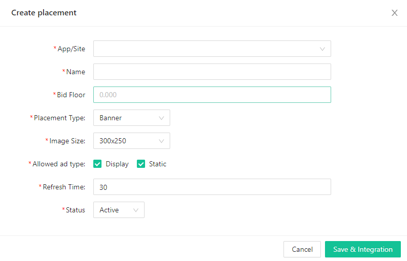

# Flat Ads SDK入门指南
欢迎您选择Flat Ads对接合作，这篇文档将指引您如何操作开发者后台并对接我们的SDK开始您的广告变现，如果您有任何问题请联系您的客户经理。
### 创建账号
请联系您的客户经理为您创建Flat Ads 开发者账号。
### 创建APP和广告位
1. 进入开发者后台后，您需要先为您的账号创建APP/Site及其Placement.

2. 进入新建弹窗，输入您APP的相关信息, 填写的字段释义如下


> Type: 流量类型是APP流量还是Web Site流量；
> Platform：APP的系统平台，是Android还是IOS，如果是Windows之类的请选择其他；
> Bundle：APP的包名；（如果您的Android APP已上架，填写包名后点击Look up，将自动填充Store URL和APP Category）
> Store URL：APP上架商店的详情页链接；
> Domain：Site的域名；
> App Categroy：APP的分类；
> Is app published：您的APP是否已上架；
> Status：APP/Site的状态，如果状态为关，其Appid和token将不再生效；
> COPPA：如果您的APP/Site遵守COPPA，请勾选上；
> TOKEN和Appid：为对接SDK时的验证密钥，新建APP后，自动生成。

3. 完成APP/Site的填写后，保存继续为其创建广告位，填写的字段释义如下


> App/Site：当前创建广告位的归属，一个App/Site可以拥有多个广告位；
> Name：广告位的名称，一般可以命名为"APPNAME_TYPE_SIZE"；
> Bid Floor：广告位的底价，只有高于这个底价的广告才会填充；
> Placement Type：广告位类型，Banner, Native, Interstitial, Rewarded Ad；
> Size：广告位尺寸；
> Allowed Ad Type：支持填充的广告类型；Display(HTML), Static, VAST Video, Playable；
> Refresh Time：Banner广告自动刷新时间；
> Muting：视频广告是否默认静音；
> Allow Skip：允许跳过的时间，单位为秒；
> CTA Popup：是否在视频播放过程中弹出CTA按钮，一般能够提升CTR，但是可能遮罩视频元素；
> Status：广告位状态，状态为关时，广告位将不再请求广告；

### 集成Flat Ads SDK
保存广告位后，就可以进入集成SDK的环节。Flat Ads SDK支持Android，IOS，Unity, Cocos。同时如果您对接了Mopub聚合SDK，我们也只支持Mopub JS Tag作为自定义网盟接入。如果你是Site流量，也可以直接部署我们的JS Tag


### 报表说明
跑出数据后，可以通过报表查看收益数据情况，以下是维度指标的说明


> 维度
> Date：日期
> App/Site：APP或者是Site
> Placement：广告位
> Country：国家
> 指标
> Impression：广告展示
> Clicks：广告点击
> CTR：广告点击率，Clicks/Impression
> eCPM：每千次展示单价，Revenue/Impression*1000
> Revenue：广告收益

# Android SDK
### 下载Flat Ads Android SDK
### 添加依赖和初始化
添加依赖

```
dependencies {
    implementation 'com.flatads.sdk:flatads:1.0.6'
}
```

初始化SDK
```
public class MainActivity extends AppCompatActivity {

    @Override
    protected void onCreate(@Nullable Bundle savedInstanceState) {
        super.onCreate(savedInstanceState);
        setContentView(R.layout.activity_main);
        
        String appId = "xxxxxxxx"; //申请时的appid
        String token = "xxxxxxxxxxxxxxxx"; //申请时的token
        
        FlatAdSDK.initialize(getApplication(), appId, token);
    }
    
}
```

初始化SDK时，需要传入APP的appid和token，这两个值可以在你的账户后台Placement管理页面中找到
 


### 修改日志

### 广告位类型
#### Banner 
* 使用Banner广告，需要向布局中添加BannerAdView
```
# main_activity.xml
    ···
    <com.flatads.sdk.ui.BannerAdView
        android:id="@+id/banner"
        android:layout_width="match_parent"
        android:layout_height="match_parent"
        app:banner_size="small_size"/>
    ···
```
app:banner_size：将此属性设置为要使用的广告尺寸。提供了2种类型的banner尺寸：small_size (320x50) 和 big_size (300x250)。不设置默认为big_size (300x250)。
布局中需给广告位设置 match_parent。

MainActivity中，需要设置广告的unitid，并且调用loadAd()，展示广告。
```
public class MainActivity extends AppCompatActivity {

    @Override
    protected void onCreate(@Nullable Bundle savedInstanceState) {
        super.onCreate(savedInstanceState);
        setContentView(R.layout.activity_main);

        String appId = "xxxxxxxx"; //申请时的appid
        String token = "xxxxxxxxxxxxxxxx"; //申请时的token

        FlatAdSDK.initialize(getApplication(), appId, token);

        BannerAdView bannerAdView = findViewById(R.id.banner);
        bannerAdView.setAdUnitId("xxxxxxx");
        bannerAdView.loadAd();
    }

}
```
* 需要监听广告相关回调事件，在相关的AdView添加Listener。
1. 加载监听
```
        bannerAdView.setAdLoadListener(new AdLoadListener() {
            @Override
            public void onAdSucLoad(AdContent adContent) {
                //广告加载成功
            }

            @Override
            public void onAdFailLoad() {
                //广告加载失败
            }
        });
```
2. 展示监听
```
        bannerAdView.setAdShowListener(new AdShowListener() {
            @Override
            public void onAdShowed() {
                //展示广告
            }

            @Override
            public boolean onAdClicked() {
                return false;  //点击拦截  false：不拦截后续事件；true：拦截
            }

            @Override
            public void onAdClosed() {
                //关闭广告
            }
        });
```

#### Native
native显示样式由用户自定义，但需要调用NativeAdLayout使用做处理，其中媒体用MediaView加载。NativeAdLayout为FrameLayout。
* 向布局中添加NativeAdLayout和MediaView

```
# main_activity.xml
<androidx.constraintlayout.widget.ConstraintLayout xmlns:android="http://schemas.android.com/apk/res/android"
    android:layout_width="match_parent"
    android:layout_height="match_parent"
    xmlns:app="http://schemas.android.com/apk/res-auto">
    <FrameLayout
        android:id="@+id/my_content"
        android:layout_width="match_parent"
        android:layout_height="wrap_content"
        app:layout_constraintTop_toTopOf="parent"/>

</androidx.constraintlayout.widget.ConstraintLayout>
```
```
# native_view.xml
    ···
    <com.flatads.sdk.ui.NativeAdLayout
        android:id="@+id/container"
        android:layout_width="match_parent"
        android:layout_height="wrap_content">

        <androidx.constraintlayout.widget.ConstraintLayout
            android:layout_width="match_parent"
            android:layout_height="match_parent">
            ···
            <com.flatads.sdk.ui.MediaView
                android:id="@+id/media"
                android:layout_width="match_parent"
                android:layout_height="0dp"
                app:layout_constraintDimensionRatio="w,9:16"
                app:layout_constraintTop_toTopOf="parent" />
            ···
        </androidx.constraintlayout.widget.ConstraintLayout>

    </com.flatads.sdk.ui.NativeAdLayout>
    ···
```
MediaView需要设置宽高比例。


```
public class MainActivity extends AppCompatActivity {

    private NativeAdLayout adView;
    @Override
    protected void onCreate(@Nullable Bundle savedInstanceState) {
        super.onCreate(savedInstanceState);
        setContentView(R.layout.activity_main);

        String appId = "xxxxxxxx"; //申请时的appid
        String token = "xxxxxxxxxxxxxxxx"; //申请时的token

        FlatAdSDK.initialize(getApplication(), appId, token);

        nativeAdView = findViewById(R.id.container);
        String adUnitId = "xxxxxxxxx";
        
        NativeAdLoadBuilder adLoader = new NativeAdLoadBuilder.Builder(adUnitId, this)
                .setAdListener(new AdLoadListener() {
                    @Override
                    public void onAdSucLoad(AdContent adContent) {
                        FrameLayout frameLayout = findViewById(R.id.my_content);
                        adView = (NativeAdView) getLayoutInflater().inflate(R.layout.native_view,null);
                        adView.setTitle(adView.findViewById(R.id.flat_ad_tv_title));//设置广告标题
                        adView.setDescribe(adView.findViewById(R.id.flat_ad_tv_desc));//设置广告描述
                        adView.setButton(adView.findViewById(R.id.flat_ad_button));//设置广告按钮
                        adView.setIcon(adView.findViewById(R.id.flat_ad_iv_icon));//设置广告icon
                        adView.setContainer(adView.findViewById(R.id.flat_ad_container));//native广告布局
                        adView.setMedia(adView.findViewById(R.id.flat_ad_media));//设置广告媒体View
                        adView.setAdShowListener(new AdShowListener() {
                            @Override
                            public void onAdShowed() {

                            }

                            @Override
                            public boolean onAdClicked() {
                                return false;
                            }

                            @Override
                            public void onAdClosed() {

                            }
                        });
                        frameLayout.removeAllViews();
                        frameLayout.addView(adView);
                        adView.showAd(adContent);
                    }

                    @Override
                    public void onAdFailLoad() {

                    }
                }).build();

        adLoader.loadAd();
    }
    
    @Override
    protected void onPause() {
        super.onPause();
        if (adView!=null){
            adView.pause();
        }
    }

    @Override
    protected void onResume() {
        super.onResume();
        if (adView!=null){
            adView.resume();
        }
    }

    @Override
    protected void onStop() {
        super.onStop();
        if (adView!=null){
            adView.stop();
        }
    }

    @Override
    protected void onDestroy() {
        super.onDestroy();
        if (adView!=null){
            adView.destroy();
        }
    }
}
```
布局元素获取必须在成功的时候绑定，处理完布局后需要调用showAd方法展示广告，否则无反应。

由于native广告存在video类型的广告，需要在Activity生命周期中对应添加广告的生命周期回调，否则播放器可能会异常。

* 广告事件
1. 加载监听
```
        setAdListener(new AdLoadListener() {
                    @Override
                    public void onAdSucLoad(AdContent adContent) {
                       //广告加载成功
                    }

                    @Override
                    public void onAdFailLoad() {
                        //广告加载失败
                    }
                })
```

2. 展示监听

```
                    adView.setAdShowListener(new AdShowListener() {
                            @Override
                            public void onAdShowed() {
                                //展示广告
                            }

                            @Override
                            public boolean onAdClicked() {
                                return false; //点击拦截  false：不拦截后续事件；true：拦截
                            }

                            @Override
                            public void onAdClosed() {
                                //关闭广告
                            }
                        });
```

> 注意： 处理完布局后需要调用showAd方法展示广告，否则无反应；成功加载广告后才能添加展示监听。

#### Interstitial

* 向布局中添加InterstitialAdView
```
# main_activity.xml
    ···
    <com.flatads.sdk.ui.InterstitialAdView
        android:id="@+id/flat_ad_container"
        android:layout_width="match_parent"
        android:layout_height="match_parent" />
    ···
```
布局中需给广告广告设置 match_parent。

```
public class MainActivity extends AppCompatActivity {

    private InterstitialAdView interstitialAdView;
    @Override
    protected void onCreate(@Nullable Bundle savedInstanceState) {
        super.onCreate(savedInstanceState);
        setContentView(R.layout.activity_main);

        String appId = "xxxxxxxx"; //申请时的appid
        String token = "xxxxxxxxxxxxxxxx"; //申请时的token

        FlatAdSDK.initialize(getApplication(), appId, token);

        interstitialAdView = findViewById(R.id.container);
        InterstitialAdLoadBuilder adLoader = new InterstitialAdLoadBuilder.Builder(adUnitId, this)
                .setAdListener(new AdLoadListener() {
                    @Override
                    public void onAdSucLoad(AdContent adContent) {
                        interstitialAdView = findViewById(R.id.flat_ad_container);
                        interstitialAdView.setAdShowListener(new AdShowListener() {
                                @Override
                                public void onAdShowed() {
                                   
                                }

                                @Override
                                public boolean onAdClicked() {
                                    return false;
                                }

                                @Override
                                public void onAdClosed() {

                                }
                            });
                        interstitialAdView.showAd(adContent);
                    }

                    @Override
                    public void onAdFailLoad() {

                    }
                }).build();

        adLoader.loadAd();
    }
    @Override
    protected void onPause() {
        super.onPause();
        if (interstitialAdView != null) {
            interstitialAdView.pause();
        }
    }

    @Override
    protected void onResume() {
        super.onResume();
        if (interstitialAdView != null) {
            interstitialAdView.resume();
        }
    }

    @Override
    protected void onStop() {
        super.onStop();
        if (interstitialAdView != null) {
            interstitialAdView.stop();
        }
    }

    @Override
    protected void onDestroy() {
        super.onDestroy();
        if (interstitialAdView != null) {
            interstitialAdView.destroy();
        }
    }

}
```

> 注意：插屏广告需要注册回调监听且在onAdSucLoad中调用showAd方法展示广告，否则将无法正常显示广告。

由于插屏广告存在video和vast类型的广告，需要在Activity生命周期中对应添加广告的生命周期回调，否则播放器可能会异常。

* 广告事件
1. 加载监听
```
        setAdListener(new AdLoadListener() {
                    @Override
                    public void onAdSucLoad(AdContent adContent) {
                       //广告加载成功
                    }

                    @Override
                    public void onAdFailLoad() {
                        //广告加载失败
                    }
                })
```

2. 展示监听

```
        interstitialAdView.setAdShowListener(new AdShowListener() {
            @Override
            public void onAdShowed() {
                //展示广告
            }

            @Override
            public boolean onAdClicked() {
                return false;  //点击拦截  false：不拦截后续事件；true：拦截
            }

            @Override
            public void onAdClosed() {
                //关闭广告
            }
        });
```
#### Rewarded Ad

### 测试集成

### 更多说明
#### GDPR
####  注意事项
1、接入时需对app开启存储权限后才可以正常下载广告配置的apk，否则部分手机将无下载反应。
2、混淆时，需添加 -keep class com.flatads.sdk.response.* {*;} ，否则将无数据返回。
3、native布局添加元素时，需要在loadAd方法之前添加，否则无法正常显示。
4、插屏广告需要注册回调监听且在onAdLoaded中调用showAd方法展示广告，否则将无法正常显示广告

# IOS SDK
### 下载Flat Ads IOS SDK
### 添加依赖
添加 Cocoapods 源
```
source 'http://git.flatincbr.com:3000/ios/cocoapod-repo.git'
```

### IOS 14适配
* SKAdNetwork（SKAN）是 Apple 的归因解决方案，可帮助广告客户在保持用户隐私的同时衡量广告活动。 使用 Apple 的 SKAdNetwork 后，即使 IDFA 不可用，广告网络也可以正确获得应用安装的归因结果。 访问https://developer.apple.com/documentation/storekit/skadnetwork了解更多信息。**为了广告转化的归因，所有开发者须设置SKAdNetwork方案的 FlatAdSDK SKAdNetwork id。**
* App Tracking Transparency (ATT)适用于请求用户授权，访问与应用相关的数据以跟踪用户或设备。 访问https://developer.apple.com/documentation/apptrackingtransparency了解更多信息。**目前苹果要求在iOS 14.5及以上的版本中必须在弹窗取得用户同意后，才可以追踪用户。对其他版本暂无明确要求，开发者应根据需要配置弹窗。**

**Checklist**
1. 应用编译环境升级至Xcode 12.0 及以上版本
2. 将 FlatAdSDK 的 SKAdNetwork ID 添加到 info.plist 中，以保证SKAdNetwork的正确运行
```
<key>SKAdNetworkItems</key>
  <array>
    <dict>
      <key>SKAdNetworkIdentifier</key>
      // FlatAdSDK SKAdNetwork id
      <string>xxxxxx.skadnetwork</string>
    </dict>
    <dict>
      <key>SKAdNetworkIdentifier</key>
      // FlatAdSDK SKAdNetwork id
      <string>xxxxxx.skadnetwork</string>
    </dict>
    <dict>
      <key>SKAdNetworkIdentifier</key>
      // FlatAdSDK SKAdNetwork id
      <string>xxxxxx.skadnetwork</string>
    </dict>
  </array>
```
3. 支持苹果 ATT：从 iOS 14 开始，若开发者设置 App Tracking Transparency 向用户申请跟踪授权，在用户授权之前IDFA 将不可用。 如果用户拒绝此请求，应用获取到的 IDFA 将自动清零，可能会导致您的广告收入的降低

* 要获取 App Tracking Transparency 权限，请更新您的 Info.plist，添加 NSUserTrackingUsageDescription 字段和自定义文案描述。代码示例：
```
<key>NSUserTrackingUsageDescription</key>
<string>该标识符将用于向您投放个性化广告</string>
```
* * 向用户申请权限时，请调用以下方法。我们建议您申请权限后再请求广告，以便 FlatAdSDK 准确的获得用户授权状态。
```
#import <FlatAds_sdk/FlatAds_sdk.h>

if (@available(iOS 14, *)) {
    [FlatAdsSDK requestIDFAWithCompletionHandler:^(ATTrackingManagerAuthorizationStatus status) {
        // Tracking authorization completed. Start loading ads here.
        [self loadAds];
     }];
 }
```

### 初始化
初始化SDK
```
#import <FlatAds_sdk/FlatAds_sdk.h>

[FlatAdsSDK setAppID:@"your appid" appToken:@"your app token"];
```

初始化SDK时，需要传入APP的appid和token，这两个值可以在你的账户后台Placement管理页面中找到
 
 
**日志输出说明**
```
#if DEBUG
    [FlatAdsSDK setLogLevel:FALogLevelDebug];
#endif
```
 
### 修改日志

### 广告位类型
#### Banner 
**创建广告位对象、请求广告 FAAdBannerView**
请求广告时需要传入广告位对象，广告位对象创建时必须传入广告位ID

```
    FAAdBannerUnitModel* unitModel = [FAAdBannerUnitModel new];
    // 目前只提供了两种样式 
    // FAAdBannerStyleDefault, // 320x50 
    // FAAdBannerStyleBig, // 320x250
    unitModel.sizeType = FAAdBannerStyleDefault;
    unitModel.viewController = self;
    unitModel.rootView = self.view;
    unitModel.unitId = @"your unit id";;
    
    FAAdBannerView *bannerView = [[FAAdBannerView alloc] initWithUnitModel:unitModel];
    [self.bannerView addSubview:view];
    bannerView.frame = CGRectMake(0, 100, self.view.frame.size.width, 50);
    [bannerView loadAds];
```
使用 FAAdBannerView 创建对象，使用 FAAdBannerView 调用 loadAds 请求广告

**FABannerAdViewDelegate  回调方法**
```
/// This method is called when adView ad slot loaded successfully.
- (void)bannerAdViewLoadSuccess:(nonnull FAAdBannerView *)bannerAdView;

/// This method is called when adView ad slot failed to load.
- (void)bannerAdView:(nonnull FAAdBannerView *)bannerAdView didLoadFailWithError:(nonnull NSError *)error;

/// This method is called when ad is clicked.
- (void)bannerAdViewDidClick:(nonnull FAAdBannerView *)bannerAdView;

/// This method is called when ad is Closed.
- (void)bannerAdViewDidClosed:(nonnull FAAdBannerView *)bannerAdView;
```

#### Native
FAAdNativeView 类提供了原生广告的数据绑定、点击事件的上报，需要开发者自行定义广告展示形态与布局。

创建广告位对象、请求广告 FAAdNativeView
请求广告时需要传入广告位对象，广告位对象创建时必须传入广告位ID
```
    FAAdUnitModel* unitModel = [FAAdUnitModel new];
    unitModel.unitId = @"your unit id";
    unitModel.viewController = self;

    [FAAdNativeView loadWithAdUnitModel:unitModel completionHandler:^(FAAdNativeView * _Nullable nativeView, NSError * _Nullable error) {
        if (!nativeView) {
            return;
        }
        [self.view addSubview:nativeView];
        self.nativeView = nativeView;
        self.nativeView.frame = CGRectMake(0, 0, 320, 280);
        self.nativeView.delegate = self;
        // 为 nativeView 里的 UI 设置 Frame 或 Auto Layout
    }]; 
```
使用 FAAdNativeView 提供的加载方法可以用作预加载
**广告 UI 素材**
```
/// media view
@property (nonatomic, readonly, strong) UIView *mediaView;

/// logo image
@property (nonatomic, readonly, strong) UIImageView *logoImageView;

/// ad title
@property (nonatomic, readonly, strong) UILabel *titleLabel;

/// ad desc
@property (nonatomic, readonly, strong) UILabel *contentLabel;

/// info button
@property (nonatomic, readonly, strong) FAInfoIconButton *infoIconButton;

/// call to action button
@property (nonatomic, readonly, strong) UIButton *ctaButton;

/// close button
@property (nonatomic, readonly, strong) UIButton *closeButton;
```

设置 infoIconButton 位置，往反方向展开

```
nativeView.infoIconButton.position = FAInfoIconButtonPositionRight;
```

**展示广告**
设置好布局后调用 renderAdData 方法渲染原生广告数据。
```
[self.nativeView renderAdData];
```
**FANativeAdViewDelegate  回调方法**
```
/// This method is called when adView ad slot failed to load.
- (void)nativeAdView:(nonnull FAAdNativeView *)nativeView didLoadFailWithError:(nonnull NSError *)error;

/// This method is called when ad is clicked.
- (void)nativeAdViewDidClick:(nonnull FAAdNativeView *)nativeView;

/// This method is called when ad is Closed.
- (void)nativeAdViewDidClosed:(nonnull FAAdNativeView *)nativeView;
```

#### Interstitial
**创建广告位对象、请求广告 FAInterstitialAd**
请求广告时需要传入广告位对象，广告位对象创建时必须传入广告位ID
```
    FAAdUnitModel* unitModel = [FAAdUnitModel new];
    unitModel.unitId = @"your unit id";
    
    [FAInterstitialAd loadWithAdUnitModel:unitModel
                        completionHandler:^(FAInterstitialAd * _Nullable interstitialAd, NSError * _Nullable error) {
        if (error) {
        } else {
            self.interstitialView = interstitialAd;
            self.interstitialView.delegate = self;
            
            [self.interstitialView presentAdFromRootViewController:self];
        }
    }];
```
使用 FAInterstitialAd 提供的加载方法可以用作预加载

**展示广告**
调用 presentAdFromRootViewController: 方法展示插屏广告，此处需要传入当前展示的页面。一定要设置rootViewController，即展示广告和跳转落地页需要的 viewController。

**FAAdInterstitialDelegate  回调方法**

```
/// This method is called when adView ad slot failed to load.
- (void)interstitialAd:(FAInterstitialAd *)interstitialAd didFailWithError:(NSError * __nullable)error;

/// This method is called when ad is clicked.
- (void)interstitialAdDidClicked:(nonnull FAInterstitialAd *)interstitialAd;

/// This method is called when ad is Closed.
- (void)interstitialAdDidClosed:(nonnull FAInterstitialAd *)interstitialAd;
```

#### Rewarded Ad

### 测试集成

### 更多说明
#### GDPR
####  注意事项
1. 必须要设置 rootViewController，用来处理广告跳转。SDK里所有的跳转均采用 present 的方式，请确保传入的 rootViewController 不能为空且没有 present 其他的控制器，否则会出现 presentedViewController 已经存在而导致 present 失败。
2. 判断广告素材是否准备好直接使用 isAdReady 判断即可

# Unity 插件
### 下载Flat Ads Unity 插件
### 初始化
### 修改日志

### 广告位类型
#### Banner 
#### Interstitial
#### Rewarded Ad

### 测试集成

### 更多说明
#### GDPR
####  注意事项

# COCOS Creator集成 Flat Ads SDK

### Android导入说明
1. 需要将FlatAd SDK的xxxx.aar文件放到Android工程的libs目录下和添加相关Maven依赖。并在build.gradle进行引用
```
dependencies {
    api fileTree(include: ['*.jar','*.aar'], dir: 'libs')
    implementation 'com.flatads.sdk:flatads:1.0.4'
}
```
并在跟目录gradle增加依赖仓库
```
maven {url "http://maven.flat-ads.com/repository/maven-public/"}
```

2. 混淆规则：
```
-keep public class com.flat.ad.forcocos.** { *; }
-keep class com.flatads.sdk.response.* {*;}
```
3. 开启Java编译。在gradle开启Java 8编译
```
compileOptions {
        sourceCompatibility JavaVersion.VERSION_1_8
        targetCompatibility JavaVersion.VERSION_1_8
    }
```

### 初始化
1. 导入SDK脚本代码到asset目录下。 
2 .使用申请到的AppId和AppToken初始化SDK
```
FlatAdSdk.initSdk(appId, appToken);
```
### 修改日志

### 广告位类型
#### Banner 
使用以下代码代码加载Banner广告。
```
FlatBannerAdJs.initBanner(unitId, style); //初始化Banner广告，传入广告ID和Banner广告样式
FlatBannerAdJs.loadBanner(unitId); //load广告，广告load完之后会自动展示。
```
banner广告支持的样式字段
```
public static final int DISPLAY_SIZE = 1;
public static final int STATIC_SIZE = 2;
public static final int STATIC_NORMAL_SIZE = 3;
public static final int DISPLAY_BIG_SIZE = 4;
public static final int STATIC_BIG_SIZE = 5;
```
增加Banner广告的监听接口
```
FlatBannerAdJs.setAdListener : function (listener)
```
其中Listener要实现的接口
```
onBannerAdLoaded : function (unitId, info);
onBannerAdLoadFail : function(unitId);
onBannerAdShow : function(unitId, info);
onBannerAdClick : function(unitId, info);
onBannerAdClose : function(unitId, info);
```

#### Interstitial
使用以下代码加载广告
```
FlatInterstitialAdJs.initInterstitial(unitId);
FlatInterstitialAdJs.setAdListener(listener);
FlatInterstitialAdJs.loadAd(unitId);
```
其中Listener需要实现的接口
```
onInterstitialAdLoaded : function (unitId, info);
onInterstitialAdLoadFail : function(unitId);
onInterstitialAdShow : function(unitId, info);
onInterstitialAdClick : function(unitId, info);
onInterstitialAdClose : function(unitId, info);
```
最后在onInterstitialAdLoaded回调方法中调用showAd的方法
```
FlatInterstitialAdJs.showAd(unitId);
```
#### Native
使用以下代码加载Native广告
```
FlatNativeAd.initNative(unitId,viewConfig); //初始化NativeView
FlatNativeAd.setAdListener(listetener); //设置回调监听
FlatNativeAd.loadNative(unitId); //loadNative
```
其中viewConfig参数为指定Native广告UI样式Json字符串，其形式如下：
```
{"root":{
    "x":100, "y":150, "width":400, "height": 500, "background":"color",
"text_size":20, "text_color":"color"
}, "icon":{"x":20, "y":20, "width":30, "height":30},
"title":{"x":50,"y":70,"width":-2, "height":-2},
"desc":{"x":0,"y":300,"width":-2,"height":-2},
"media":{"x":100,"height":140,"width":-2,"height":-2},
"cta":{ "x":300,"y":400, "width":60,"height":30}}
```
x,y为View的坐标，width，height为宽高，background为背景色，text_size为字体大小，text_color为字体颜色。
其中listener需要实现以下接口

```
onNativeAdLoaded : function(unitId, info);
onAdFailLoaded : function(unitId, info);
onNativeAdShow: function (unitId, info);
onNativeAdClick : function (unitId, info);
onNativeAdClose : function (uitId, info);
```

最后在onInterstitialAdLoaded回调方法中调用showAd的方法
```
FlatNativeAd.showAd(unitId);
```
#### Rewarded Ad

### 测试集成

### 更多说明
#### GDPR
####  注意事项

# 广告响应参数说明
广告日志TAG：adReq
### 返回参数列表
| 参数名| 类型 |说明|
| :-----| :-----|
|imp_id|string|展示id
|unitid|string|广告位id
|platform|string|dsp名称
|campaign_id|string|广告机会id
|creative_id|string|素材id
|ad_type|string|广告类型： NATIVE BANNER VIDEO
|action|string|点击广告动作类型（配合link使用），browser:在浏览器打开, market:在google play打开, apk:在端内打开
|title|string|标题
|desc|string|描述
|app_bundle|string|包名
|deep_link|string|深度链接（点击广告后如果已经安装，需要跳转到的app内指定页面，如果未安装需要安装后跳转到deeplink指定的页面）
|app_ver|string|被推广的app版本
|link|string|广告链接（点击广告跳转的路径，如果是vast 需要终端从协议中解析出<ClickThrough>）
|ad_btn|string|按钮文案
|refresh_interval|int|刷新时间间隔
|req_id|string|请求id
|imp_trackers|字符串数组|展示追踪链数组（广告展示时调用）
|click_trackers|字符串数组|点击追踪链数组（用户点击广告时调用）
|image|object|图片object
|icon|object|icon object
|video|object|video object
|app_icon|string|被推广的app的图标
|win_dsp_id|string|胜出的dsp id
|app_size|string|被推广的app大小
|app_category|string|被推广的app分类
|advertiser_name|string|被推广包的广告主名称
|html|string|html内容
|is_mute|int|是否静音 0否 1是
|refresh_time|int|刷新时间间隔的秒数 0 不刷新
|is_cta|int|是否需要cta点击 0否 1是
|cta_desc|string|cta点击描述
|skip_after|int|允许跳过广告的最小秒数
|xml|string|vast协议内容
|show_type|string|html static video vast playable

**Icon & 图片**
|参数|类型|说明
|:---|:---|
|url|string|资源链接
|h|int|高
|w|int|宽

**视频**
|参数|类型|说明
|:---|:---|
|url|string|资源链接
|h|int|高
|w|int|宽
|size|int|视频大小
|duration|int|视频时长
|ad_btn_jump_type|int


### 异常状态码
| 状态码（status）| 说明 |描述（msg)|
| :-----| :-----|
| 40003|签名验证失败 |not validate|
|40101|广告位不存在|Not bidding:tagid not actived
|40102|adx 流控|request next time please
|40103|没有匹配的广告返回|no ads from all dsps
|40201 | 参数错误|empty appid or sign


