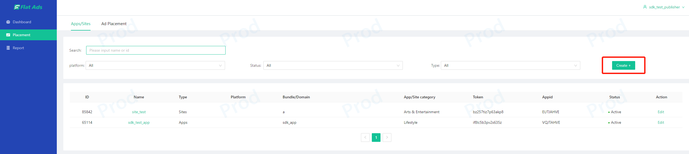
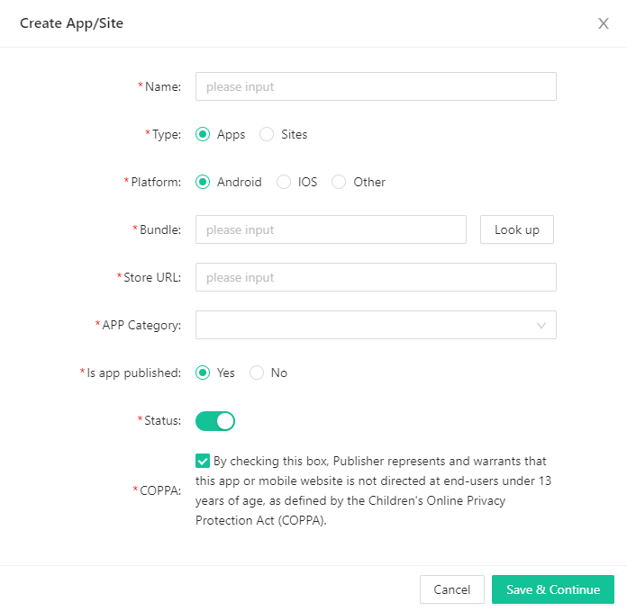
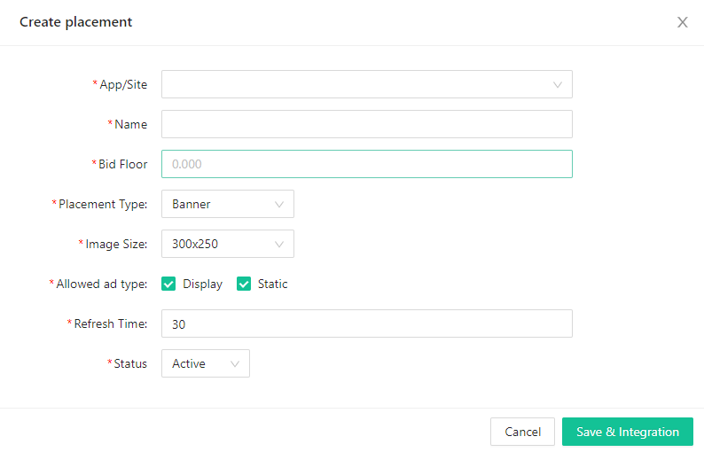
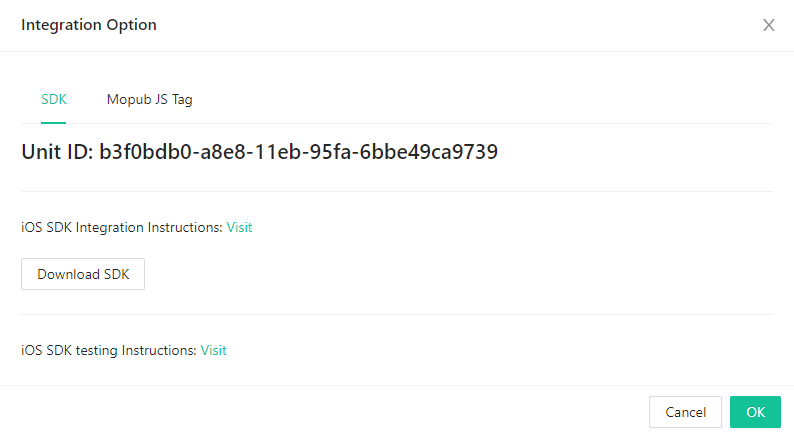
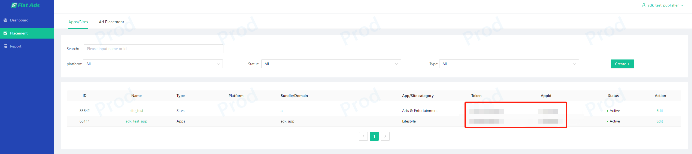

# Flat Ads SDK Start Guide
Welcome to cooperate with Flat Ads. This document will guide you how to operate the developer background and start your ad realization with our SDK. If you have any questions, please contact your account manager.
### Create an account
Please contact your account manager to create a Flat Ads developer account for you.
### Create APP and Ads Placement
1. After entering the developer background, you need to create APP/Site and its Placement for your account first.

2. Enter the new pop-up window and type down the information of your APP. The definition of the fields to fill in are as follows



> Type: whether the traffic type is APP traffic or Web Site traffic;
> 
> Platform: whether the system platform of APP is Android or IOS, if it is Windows or others, please select "other";
> 
> Bundle: the package name of the APP; (If your Android APP has already been published, fill in the package name and click "Look up",  the Store URL and APP Category will be automatically filled in)
> 
> Store URL: the detailed page link of the APP on the APP store;
> 
> Domain: the domain name of the site;
> 
> App Categroy: the category of your APP;
> 
> Is app published: whether your APP is available in the APP store;

> Status: the status of the APP/Site. If the status is "off", its Appid and token will no longer be effective;
> 
> COPPA: If your APP/Site complies with COPPA, please tick the box;
> 
> TOKEN and Appid: the verification key when connecting to the SDK. After creating an APP, it will be automatically generated.
> 

3. After filling the APP/Site, save the information and continue to create Ad placement for it. The definition of the fields to fill in are as follows  


> App/Site: the owner of the current Ad placement. One App/Site can have multiple Ad placements;
> 
> Name: the name of the Ad placement, generally can be named as "APPNAME_TYPE_SIZE";
> 
> Bid Floor: the floor price of the Ad placement, only the ads higher than the floor price will be filled;
> 
> Placement Type: the type of the Ad placement, including Banner, Native, Interstitial, Rewarded Ad;
> 
> Size: the size of Ad placement;
> 
> Allowed Ad Type: the types of ads that can be filled, including Display(HTML), Static, VAST Video, Playable;
> 
> Refresh Time:  the automatic refresh time of Banner ad;
> 
> Muting: whether the video ads is muted by default;
> 
> Allow Skip: The time allowed to skip, the measurement unit is second;
> 
> CTA Popup : whether to pop up CTA button during video playback, this choice is generally able to increase CTR but may mask video elements;
> 
> Status: the status of the Ad placement. When the status is off, the Ad placement will no longer request ads;
> 

### Flat Ads SDK Integration
After saving the Ad placement, you can enter the SDK integration. Flat Ads SDK currently only supports Android app access. At the same time, if you have connected to Mopub aggregation SDK, we also support Mopub JS Tag as a custom network alliance access. If you are a site traffic, you can also directly deploy our JS Tag  


### Statement Description
When the data are processed, you can view the earnings data through the report. The instructions of the dimension indicators are as follows


> Dimension
> 
> Date: the date
> 
> App/Site: App or Site
> 
> Placement: Ad placement
> 
> Country: country
> 
> Indicators
> 
> Impression: Advertising Display
> 
> Clicks: Ad clicks
> 
> CTR: Ads click-through rate, Clicks/Impression
> 
> eCPM: unit price per thousand displays, Revenue/Impression * 1000
> 
> Revenue: Ads Revenue
> 

# Android SDK
### Adding Dependencies and Initialization
Add Dependency

```
dependencies {
    implementation 'com.flatads.sdk:flatads:1.4.18.2-Flat-GP'
}

//

allprojects {
    repositories {
        maven {url "https://maven-pub.flat-ads.com/repository/maven-public/"}
        maven { url  "https://jitpack.io" }
    }
}

//ProGuard
-keep class com.flatads.sdk.** {*;} 
```

SDK Initialization
```Java
public class MainActivity extends AppCompatActivity {

    @Override
    protected void onCreate(@Nullable Bundle savedInstanceState) {
        super.onCreate(savedInstanceState);
        setContentView(R.layout.activity_main);
        
        String appId = "xxxxxxxx"; 
        String token = "xxxxxxxxxxxxxxxx"; 
        
        FlatAdSDK.initialize(getApplication(), appId, token, new InitListener(){
            @Override
            public void onSuccess() {
            }

            @Override
            public void onFailure(int code, String msg) {
            }
        }, new SdkConfig());
    }
    
}
```

Ad must be called after initialization is complete!

When initializing SDK, you need to pass in the appid and token of the APP, which can be found in the Placement management page in your account background.


### Ad Placement Type
#### Banner 
* When using Banner ads, you need to add BannerAdView to the layout
```
# main_activity.xml
    ···
    <com.flatads.sdk.ui.view.BannerAdView
        android:id="@+id/banner"
        android:layout_width="match_parent"
        android:layout_height="match_parent"
        app:banner_size="small_size"/>
    ···
```
App: banner_size: Set this property to the ad size you want to use. Two types of banner sizes are provided: small_size (320x50) and big_size (300x250). If not set, the default is  big_size (300x250). In the layout, match_parent needs to be set for the Ad placement. The setBannerSize method is provided, and because it operates on the layout, it must be executed in the main thread.

In the MainActivity, you need to set the ad's unitid and call loadAd() to display the ad.
```
public class MainActivity extends AppCompatActivity {

    @Override
    protected void onCreate(@Nullable Bundle savedInstanceState) {
        super.onCreate(savedInstanceState);
        setContentView(R.layout.activity_main);

        String appId = "xxxxxxxx"; 
        String token = "xxxxxxxxxxxxxxxx"; 

        FlatAdSDK.initialize(getApplication(), appId, token, new InitListener(){
            @Override
            public void onSuccess() {
            }

            @Override
            public void onFailure(int code, String msg) {
            }
        }, new SdkConfig());
        
        BannerAdView bannerAdView = findViewById(R.id.banner);
        bannerAdView.setAdUnitId("xxxxxxx");
        bannerAdView.loadAd();
    }

    @Override
    protected void onResume() {
        super.onResume();
        if (bannerAdView != null) {
            bannerAdView.resume();
        }
    }

    @Override
    protected void onStop() {
        super.onStop();
        if (bannerAdView != null) {
            bannerAdView.stop();
        }
    }

    @Override
    protected void onDestroy() {
        super.onDestroy();
        if (bannerAdView != null) {
            bannerAdView.destroy();
        }
    }

}
```
* You need to listen to ad-related callback events and add Listener to the relevant AdView.
```
    bannerAdView.setAdListener(new BannerAdListener() {
        @Override
        public void onAdExposure() {
        }

        @Override
        public void onRenderFail(int code, String msg) {
        }


        @Override
        public void onAdClick() {
        }

        @Override
        public void onAdClose() {
        }

        @Override
        public void onAdLoadSuc() {
        }

        @Override
        public void onAdLoadFail(int code, String msg) {
        }

        @Override
        public void onRefresh() {
        }
    });
```

#### Native
The display style of native is user-defined, but you need to call the NativeAdLayout to use for processing, where the media is loaded by MediaView. The NativeAdLayout is FrameLayout . 
* Add NativeAdLayout and MediaView to the layout

```
# main_activity.xml
<androidx.constraintlayout.widget.ConstraintLayout xmlns:android="http://schemas.android.com/apk/res/android"
    android:layout_width="match_parent"
    android:layout_height="match_parent"
    xmlns:app="http://schemas.android.com/apk/res-auto">
    <FrameLayout
        android:id="@+id/container"
        android:layout_width="match_parent"
        android:layout_height="wrap_content"
        app:layout_constraintTop_toTopOf="parent"/>

</androidx.constraintlayout.widget.ConstraintLayout>
```
```
# native_layout.xml
<?xml version="1.0" encoding="utf-8"?>
<com.flatads.sdk.ui.view.NativeAdLayout xmlns:android="http://schemas.android.com/apk/res/android"
    xmlns:app="http://schemas.android.com/apk/res-auto"
    xmlns:tools="http://schemas.android.com/tools"
    android:id="@+id/flat_ad_container"
    android:layout_width="match_parent"
    android:layout_height="300dp"
    android:background="@color/white"
    app:layout_constraintBottom_toBottomOf="parent"
    app:layout_constraintTop_toTopOf="parent">

    <androidx.constraintlayout.widget.ConstraintLayout
        android:layout_width="match_parent"
        android:layout_height="match_parent">

        <com.flatads.sdk.ui.view.MediaView
            android:id="@+id/flat_ad_media_big"
            android:layout_width="match_parent"
            android:layout_height="0dp"
            app:layout_constraintDimensionRatio="w,9:16"
            app:layout_constraintTop_toTopOf="parent" />

        <ImageView
            android:id="@+id/flat_ad_iv_icon"
            android:layout_width="42dp"
            android:layout_height="42dp"
            android:layout_marginStart="8dp"
            android:layout_marginLeft="8dp"
            android:layout_marginTop="12dp"
            android:layout_marginBottom="12dp"
            app:layout_constraintBottom_toBottomOf="parent"
            app:layout_constraintStart_toStartOf="parent"
            app:layout_constraintTop_toBottomOf="@id/flat_ad_media_big" />

        <TextView
            android:id="@+id/flat_ad_button"
            android:layout_width="0dp"
            android:layout_height="wrap_content"
            android:layout_marginTop="21dp"
            android:layout_marginEnd="12dp"
            android:layout_marginRight="12dp"
            android:layout_marginBottom="21dp"
            android:background="@drawable/shape_bg"
            android:paddingStart="10dp"
            android:paddingEnd="10dp"
            android:paddingTop="5dp"
            android:paddingBottom="5dp"
            app:layout_constraintBottom_toBottomOf="parent"
            app:layout_constraintEnd_toEndOf="parent"
            app:layout_constraintTop_toBottomOf="@id/flat_ad_media_big"
            tools:text="sdasdasdsa"/>

        <TextView
            android:id="@+id/flat_ad_tv_title"
            android:layout_width="0dp"
            android:layout_height="wrap_content"
            android:layout_marginStart="8dp"
            android:layout_marginLeft="8dp"
            android:layout_marginEnd="16dp"
            android:layout_marginRight="16dp"
            android:textColor="@color/text_color"
            android:textSize="14sp"
            android:textStyle="bold"
            app:layout_constraintEnd_toStartOf="@id/flat_ad_button"
            app:layout_constraintStart_toEndOf="@id/flat_ad_iv_icon"
            app:layout_constraintTop_toTopOf="@id/flat_ad_iv_icon" />

        <TextView
            android:id="@+id/flat_ad_tv_desc"
            android:layout_width="0dp"
            android:layout_height="wrap_content"
            android:layout_marginStart="8dp"
            android:layout_marginLeft="8dp"
            android:layout_marginTop="5dp"
            android:layout_marginEnd="16dp"
            android:layout_marginRight="16dp"
            android:textColor="@color/text_des_color"
            android:textSize="12sp"
            app:layout_constraintEnd_toStartOf="@id/flat_ad_button"
            app:layout_constraintStart_toEndOf="@id/flat_ad_iv_icon"
            app:layout_constraintTop_toBottomOf="@id/flat_ad_tv_title" />


    </androidx.constraintlayout.widget.ConstraintLayout>

</com.flatads.sdk.ui.view.NativeAdLayout>

```
You need to set the width to height ratio in MediaView.


```
public class MainActivity extends AppCompatActivity {

    private NativeAd nativeAd;
    @Override
    protected void onCreate(@Nullable Bundle savedInstanceState) {
        super.onCreate(savedInstanceState);
        setContentView(R.layout.activity_main);

        String appId = "xxxxxxxx"; 
        String token = "xxxxxxxxxxxxxxxx"; 

        FlatAdSDK.initialize(getApplication(), appId, token, new InitListener(){
            @Override
            public void onSuccess() {
            }

            @Override
            public void onFailure(int code, String msg) {
            }
        }, new SdkConfig());
        
        nativeAdView = findViewById(R.id.container);
        String adUnitId = "xxxxxxxxx";
        
        nativeAd = new NativeAd(this,adUnitId );

        nativeAd.setAdListener(new NativeAdListener() {
            @Override
            public void onAdLoadSuc(Ad ad) {
                inflateAd(ad);
            }

            @Override
            public void onAdLoadFail(int errorCode, String msg) {
            }

            @Override
            public void onAdExposure() {
            }

            @Override
            public void onAdClick() {
            }

            @Override
            public void onAdDestroy() {
            }

            @Override
            public void onRenderFail(int code, String msg) {

            }
        });
        nativeAd.loadAd();
    }

    private void inflateAd(Ad ad) {
        adView = (NativeAdLayout) getLayoutInflater().inflate(R.layout.native_layout, null);

        TextView tvTitle = adView.findViewById(R.id.flat_ad_tv_title);
        TextView tvDesc = adView.findViewById(R.id.flat_ad_tv_desc);
        TextView tvAdBtn = adView.findViewById(R.id.flat_ad_button);
        View view = adView.findViewById(R.id.flat_ad_container);
        ImageView icon = adView.findViewById(R.id.flat_ad_iv_icon);
        MediaView mediaView = adView.findViewById(R.id.flat_ad_media_big);

        tvTitle.setText(ad.getTitle());
        tvDesc.setText(ad.getDesc());
        tvAdBtn.setText(ad.getAdBtn());

        // Create a list of clickable views
        List<View> clickableViews = new ArrayList<>();
        clickableViews.add(tvAdBtn);
        clickableViews.add(view);

        nativeAd.registerViewForInteraction(adView, mediaView, icon, clickableViews);

    }
    
	@Override
    protected void onStop() {
        super.onStop();
        if (adView!=null){
            adView.stop();
        }
    }

    @Override
    protected void onResume() {
        super.onResume();
        if (adView!=null){
            adView.resume();
        }
    }


    @Override
    protected void onDestroy() {
        super.onDestroy();
        if (adView!=null){
            adView.destroy();
        }
    }
}
```
Element retrieval in the layout must be bound upon success. Operations on the layout are required after loading is successful. Lastly, call nativeAd.registerViewForInteraction, and  hand over adView, mediaView, icon, clickableViews for nativeAd to process.
> Note: You need to destroy the adview at activity destroy


* When an advertisement is drawn out in the list, it is necessary to unbind the advertisement View and release the View object.


```java
nativeAd?.destroyView()
adView?.destroy()
adView = null
```

* When the ad returns to the screen, just rebind it in onBindViewHolder() of the Adapter

```java
@Override
public void onBindViewHolder(@NonNull ViewHolder holder, int position) {
    // Get the advertising object nativeAd from the cache
    // Get the reused AdView from ViewHolder
    ...
    // Bind advertising View and advertising object
    nativeAd.registerViewForInteraction(adView, mediaView, icon, clickableViews);
    ...
}
```

* When used alone with a page, the advertisement is bound to the life cycle of the page.

```java

@Override
protected void onResume() {
    super.onResume();
    if (adView!=null){
        adView.resume();
    }
}

@Override
protected void onStop() {
    super.onStop();
    if (adView!=null){
        adView.stop();
    }
}

@Override
protected void onDestroy() {
    super.onDestroy();
    if (nativeAd != null){
        nativeAd?.destroyView()
        nativeAd?.destroy()
    }
    if (adView!=null){
        adView.destroy();
        adView = null
    }
}
```


The layout element acquisition must be bound when successful. After processing the layout, the nativeAd.registerViewForInteraction() method needs to be called to display the advertisement, otherwise there will be no response.

Since native ads include video-type ads, the life cycle callback of the ad needs to be added in the Activity life cycle, otherwise the player may be abnormal.


#### Interstitial

```
public class MainActivity extends AppCompatActivity {

    private InterstitialAd interstitialAd;
    @Override
    protected void onCreate(@Nullable Bundle savedInstanceState) {
        super.onCreate(savedInstanceState);
        setContentView(R.layout.activity_main);

        String appId = "xxxxxxxx"; 
        String token = "xxxxxxxxxxxxxxxx"; 

        FlatAdSDK.initialize(getApplication(), appId, token, new InitListener(){
            @Override
            public void onSuccess() {
            }

            @Override
            public void onFailure(int code, String msg) {
            }
        }, new SdkConfig());
        
        String adUnitId = "xxxxxxxxx";
        interstitialAd = new InterstitialAd(this, adUnitId);
        interstitialAd.setAdListener(new InterstitialAdListener() {
            @Override
            public void onAdLoadSuc() {
                interstitialAd.show();
            }

            @Override
            public void onAdClose() {
            }

            @Override
            public void onAdLoadFail(int code, String msg) {
            }

            @Override
            public void onAdExposure() {
            }

            @Override
            public void onRenderFail(int code, String msg) {

            }

            @Override
            public void onAdClick() {
            }
        });
        interstitialAd.loadAd();
    }

}
```
You need to call the show method to display the ad when the request for ad is completed. 

#### Reward Video
```
public class RewardedActivity extends AppCompatActivity {

    RewardedAd rewardedAd;

    @Override
    protected void onCreate(@Nullable Bundle savedInstanceState) {
        super.onCreate(savedInstanceState);
        setContentView(R.layout.rewarded_test);
        Map<String, String> map = new HashMap<>();
        map.put("customer_id", "1234567");
        map.put("unique_id", "uihj89uijkbn7uy8");
        map.put("reward_type", "add_coins");
        map.put("reward_value", "2");
        map.put("verifier", "tyuidjkol");
        map.put("extinfo", "{'self define':'xxx'}");
        String adUnitId = "xxxxxxxxxxxxxxxx";
        rewardedAd = new RewardedAd(this,adUnitId);
        rewardedAd.setRequestParams(map);
        rewardedAd.setAdListener(new RewardedAdListener() {
            @Override
            public void onAdClose() {
            }

            @Override
            public void onUserEarnedReward() {
            }

            @Override
            public void onAdFailedToShow() {
            }

            @Override
            public void onAdExposure() {
            }

            @Override
            public void onAdClick() {
            }

            @Override
            public void onAdLoadSuc() {
            }

            @Override
            public void onAdLoadFail(int code, String msg) {
            }
        });
        rewardedAd.loadAd();

    }

}
```
* Advertising display

Display rewarded ads through the rewardedAd.show() method

```java
rewardedAd.show();
```
> Note: When the request is successful, isReady() will be true, which can be used to determine whether the ad is ready. Before loading reward ads, information of the reward ads is required (the above is test data)

|  Field Name   | Type  |  Value (Example)  |  Description  ||
|  ----  | ----  | ----  | ----  | ----  |
| customer_id  | string |1234567|ID of the rewarded customer|Optional|
| unique_id  | string |uihj89uijkbn7uy8|Unique ID of the reward|Optional|
|  reward_type   | Reward Type|add_coins|Type of reward, custom-defined by developer|Optional|
|  reward_value  | Reward Value  |2|Value of reward, custom-defined by developer|Optional|
| verifier  | Verifier |tyuidjkol|Verification code generated by the integrator for callback chain validation|Optional|
| extinfo  | Extra Information |{"self define":"xxx"}|Custom-defined by the integrator||


#### Interactive Ads
The size of the interactive ads is determined by the developer. When using, loadAd can be triggered first, and then the layout can be added to the interface to display the ad content faster.
```
    ...
    <com.flatads.sdk.ui.view.InteractiveView
        android:id="@+id/interactive_view"
        android:layout_width="50dp"
        android:layout_height="50dp"
        />
    ...
```
```
public class MainActivity extends AppCompatActivity {

    private InteractiveView interactiveView;
    @Override
    protected void onCreate(@Nullable Bundle savedInstanceState) {
        super.onCreate(savedInstanceState);
        setContentView(R.layout.activity_main);

        String appId = "xxxxxxxx"; 
        String token = "xxxxxxxxxxxxxxxx"; 

        FlatAdSDK.initialize(getApplication(), appId, token, new InitListener(){
            @Override
            public void onSuccess() {
            }

            @Override
            public void onFailure(int code, String msg) {
            }
        }, new SdkConfig());
        
        String adUnitId = "xxxxxxxxx";
        interactiveView = findViewById(R.id.interactive_view);
        interactiveView.setAdUnitId(adUnitId);
        interactiveView.setCacheTime(60 * 1000 * 60 * 24);
        interactiveView.setAdListener(new InteractiveAdListener() {
            @Override
            public void onRenderSuccess() {
            }

            @Override
            public void onRenderFail(int code, String msg) {
            }

            @Override
            public void onAdClick() {
            }

            @Override
            public void onAdClose() {
            }

            @Override
            public void onAdLoadSuc() {
            }

            @Override
            public void onAdLoadFail(int code, String msg) {
            }
        });
        interactiveView.loadAd();
    }

}
```

setCacheTime is to set the cache time. The default is 24 hours.

If the developer wants to specify an interactive ad icon image, a method of setting is provided:
```
interactiveView.setIconView(Drawable)
interactiveView.setIconView(Bitmap)
interactiveView.setIconView(url)
```

Note: The onDestroy method needs to be called when destroying Activity.
```
interactiveView.onDestroy()
```

> Note:1. Interactive ads need to be called as soon as possible. For example, interactive ads can be loaded when entering app, and view can be added to the layout when interactive ads need to be displayed. 2. When the ad callbacks onRenderSuccess, the webview has completed loading.

### Splash Screen Ads
Call the following code in the onCreate method of the APP startup page Activity:

```

String unitid = "xxxxxxxxx";  
OpenScreenAd openScreenAd = new OpenScreenAd(SplashActivity.this, unitid);

openScreenAd.setAdListener(new OpenScreenAdListener() {
@Override
public void onAdExposure() {

        }

@Override
public void onRenderFail(int code, String msg) {

        }

@Override
public void onAdClick() {

        }

@Override
public void onAdClose() {
        startActivity(new Intent(SplashActivity.this,DemoActivity.class));
        finish();
        }

@Override
public void onAdLoadSuc() {
        showAdIfReady();
        }

@Override
public void onAdLoadFail(int code, String msg) {

        }
});

```


* Load Ad

Use the openScreenAd.loadAd() method to request ads. Since it requires network requests and local resource reading, it is a time-consuming operation. It can be loaded on the opening screen startup page. It is recommended to call it after the opening screen advertisement is closed to preload the next time. Open screen ads.

```java
openScreenAd.loadAd();

```

* Display ths Ad

```java
private void showAdIfReady(){
   if ( openScreenAd == null || !FlatAdSDK.INSTANCE.isInit() ) return;

   if (openScreenAd.isReady() ){
       openScreenAd.show();
   }
}
```

* openScreenAd.isReady() is used to determine whether the current ad is ready for display. When isReady returns true, it means that the open-screen ad has been loaded and can be used for display.

* openScreenAd.show() is to open an open-screen advertisement. The show process does not require an Internet connection.


> Note: You need to call the show() method to display ads after setting up the Listener.

### More Instructions

####  Precautions

1. The apk of ad configuration can be downloaded normally only after the storage permission of app is turned on during connecting, otherwise some mobile phones will have no download response.
2. For confusion, add -keep class com.flatads.sdk.response.* {*;}. Otherwise, no data will be returned.

```
<?xml version="1.0" encoding="utf-8"?>
<network-security-config xmlns:tools="http://schemas.android.com/tools"
    tools:ignore="MissingDefaultResource">
    <base-config cleartextTrafficPermitted="true">
        <trust-anchors>
            <certificates src="system" overridePins="true" />
            <certificates src="user" overridePins="true" />
        </trust-anchors>
    </base-config>
</network-security-config>
```
Next, add the following attributes to the application tag under the AndroidManifest.xml file
```

<application
...
 android:networkSecurityConfig="@xml/network_security_config"
...
    />
```

# Ad Response Parameter Instruction
### Status Error Code
|Status Code| Instruction |Description（msg)|
|:-----|:-----|:-----|
|40003|Signature validation failed |not validate|
|40101|Ad placement doesn't exist|Not bidding:tagid not actived|
|40102|adx flow control|request next time please|
|40103|No matching ads returned|no ads from all dsps|
|40201 | Parameter error|empty appid or sign|

### Client Error Code
|Status code（status）| Instruction              | Description（msg)                                      |
|:-----|:----------------|:---------------------------------------------|
|1001| Unknown error            | Unknown error                                |
|2001| SDK initialization error        | The SDK initialization error                 |
|2002| Simulator Environment           | is Multi Box                                 |
|4001| Ad unitId is empty    | Ad unitId is empty                           |
|4002|  Empty ad information data returned       | No Ads                                       |
|4003 | Ad resource loading failed          | Load Ad res Failed                           |
|4004 | Ad not ready          | Ads not ready                                |
|4005 | Ad parsing error    | Ad parse error                               |
|4006| Ad loading error          | Ad load too frequently or AppContext is null |
|4007| webView not installed      | WebView not install                          |
|4008| webview js log reported | WebView Error            |
|4009| No ad data available       | There is no available data             |


